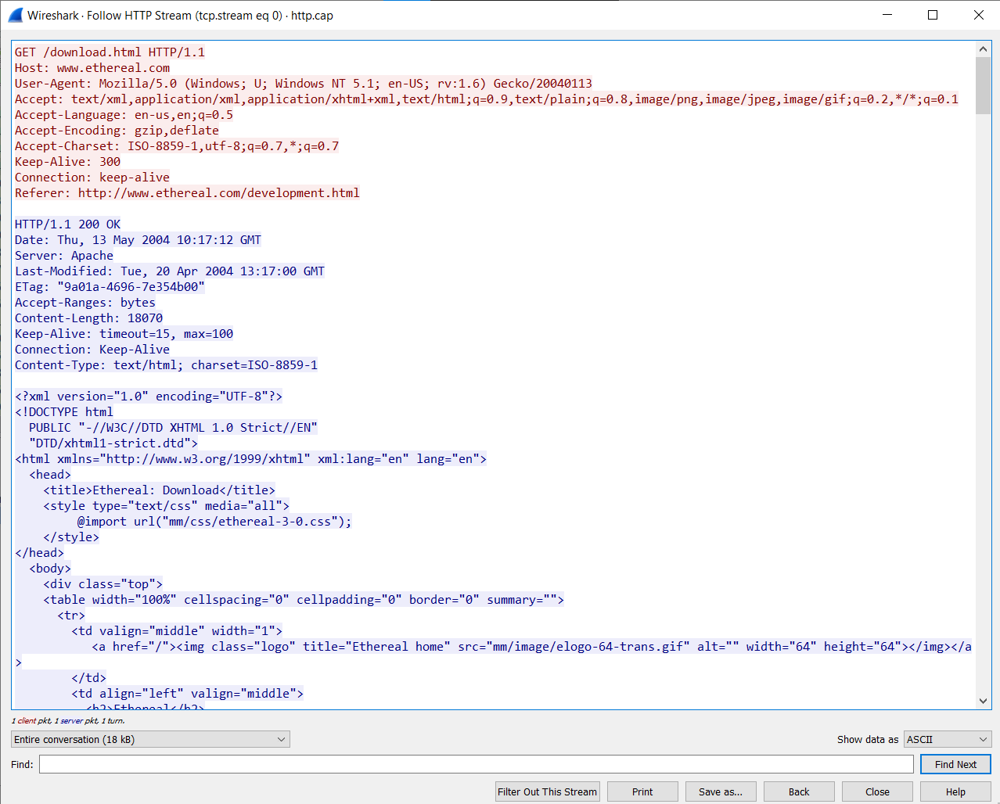
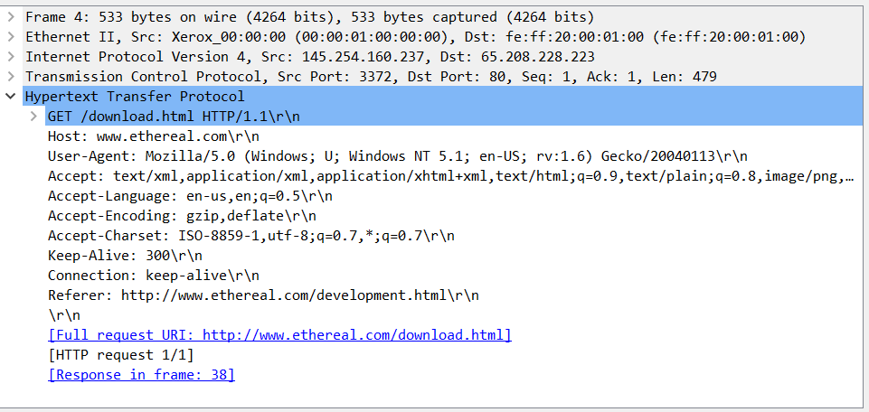
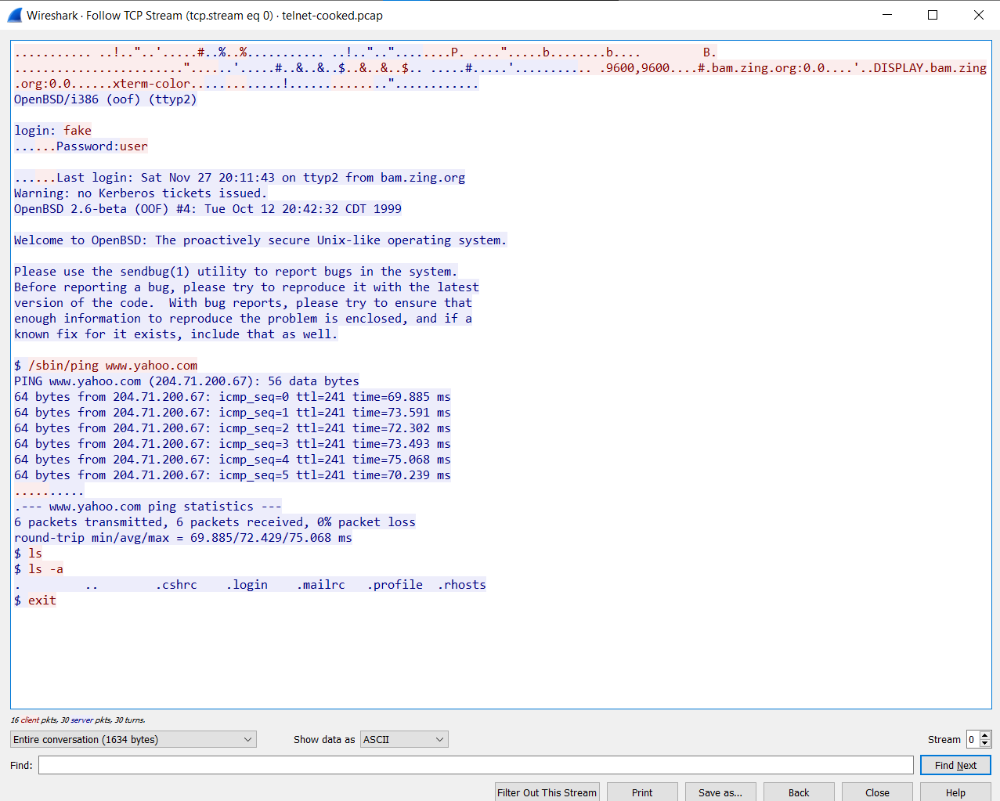
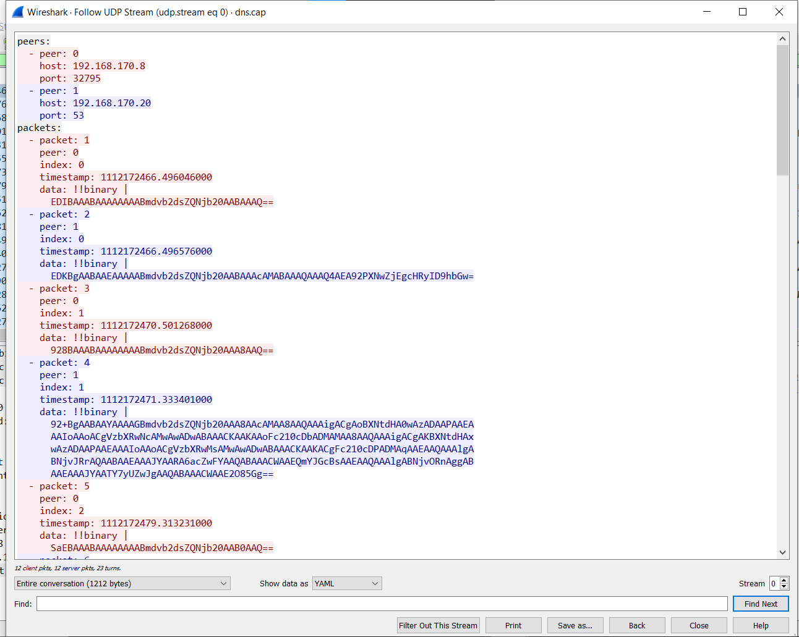

### Pendahuluan
Di sini kita akan menganalisa http.cap, telnet-cooked.cap, dan dns.cap yang kita dapatkan dari https://wiki.wireshark.org/SampleCaptures menggunakan Wireshark.

### HTTP
 

 
<i>Wireshark Packet Counter</i>

 

Kita bisa melihat statistik dari file http.cap dengan mengklik Statistics -> HTTP -> Packet Counter di toolbar. Berikut adalah informasi yang ada di dalam Packet Counter:
* Total Packets: Jumlah total paket HTTP yang ditangkap.
* Requests: Jumlah total request HTTP yang ditangkap.
* Responses: Jumlah total response HTTP yang ditangkap.
* Errors: Jumlah packet error HTTP yang ditangkap.
* Most Common Request Methods: Metode Request HTTP yang paling digunakan.
* Most Common Response Codes: Response Code yang paling banyak dikembalikan.

Dari data statistik http.cap, kita bisa melihat bahwa ada 4 HTTP Packet, yaitu 2 Response Packet (Success 200 OK semua) dan 2 Request Packet (Metode GET semua).

Lalu kita juga bisa klik kanan salah satu datanya dan pilih Follow -> HTTP Stream untuk mengikuti dan menganalisis aliran data HTTP antara klien (biasanya web browser) dan server web dalam sesi HTTP tertentu. Fitur ini berguna untuk memahami bagaimana dua host saling berinteraksi dan untuk mengidentifikasi masalah dalam percakapan.
 

 
<i>Follow HTTP Stream</i>

 

Text yang berwarna merah adalah request yang dikirim oleh client. Sedangkan yang berwarna biru adalah response yang dikembalikan oleh server.

Dari situ kita bisa melihat bahwa client mengirimkan request GET dengan endpoint /download.html menggunakan HTTP 1.1. Host dari endpoint tersebut adalah www.ethereal.com. Lalu response yang dikembalikan oleh server adalah 200 OK, menandakan request sukses. Lalu body dari responsenya adalah kode HTML.

 

 
<i>HTTP Info</i>

 

Selain itu, kita juga bisa melihat informasi dari HTTP request tersebut di kiri bawah lalu expand Hypertext Transfer Protocol.

### Telnet Cooked
 

 
<i>Follow TCP Stream Telnet </i>

 
Ada beberapa hal yang bisa kita amati di telnet-cooked.pcap:

* Username dan password yang digunakan untuk masuk ke server Telnet.
* Perintah yang dikeluarkan ke server Telnet.
* Tanggapan dari server Telnet.
* Kesalahan apa pun yang terjadi selama sesi Telnet.

### DNS
 

 
<i>Follow UDP Stream DNS </i>

 
Ada beberapa hal yang bisa kita amati di dns.cap:

* Domain yang di-query.
* Tipe query yang di-request.
* IP Address yang dikembalikan oleh respons.
* Kesalahan apa pun yang terjadi selama sesi query DNS.
