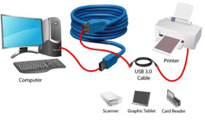
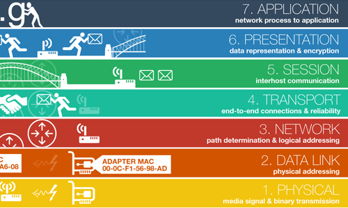
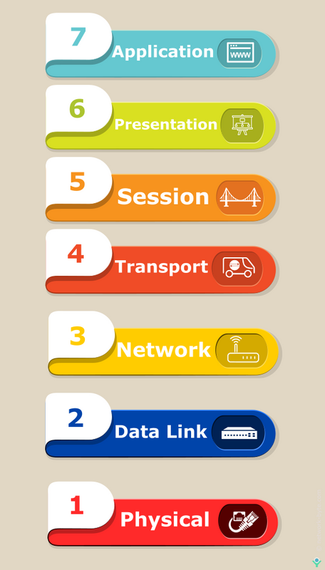

## Pengenalan

- <b>Protocol</b>: Seperangkat aturan dan regulasi.
- <b>Communication</b>: Pertukaran informasi dari satu sistem ke sistem lainnya melalui suatu media.
- <b>Communication Protocol</b>: Seperangkat aturan dan regulasi yang memungkinkan dua perangkat elektronik untuk terhubung guna bertukar data satu dengan yang lainnya.

## Apa itu Communication Protocol?

Deskripsi yang tepat mengenai format pesan digital serta aturan-aturannya dikenal sebagai protokol komunikasi. Fungsi utama dari protokol-protokol ini adalah untuk bertukar pesan antara satu sistem komputer dengan sistem komputer lainnya. Protokol-protokol ini memiliki peran penting dalam sistem telekomunikasi karena mereka secara konsisten mengirimkan dan menerima pesan-pesan. Protokol-protokol ini mencakup deteksi dan koreksi kesalahan, sinyal, dan otentikasi. Mereka juga dapat menjelaskan semantik, sintaksis, dan menggabungkan komunikasi analog dan digital.

 

 
<i>Communication Protocols</i>

 
Implementasi dari protokol-protokol ini dapat dilakukan baik dalam perangkat keras maupun perangkat lunak. Oleh karena itu, protokol komunikasi tersedia dalam ribuan jenis yang digunakan di seluruh komunikasi analog dan digital, sehingga jaringan komputer tidak dapat ada tanpa mereka.

## Kenapa Communication Protocol Penting?

Communication Protocol membantu berbagai perangkat jaringan untuk berkomunikasi satu sama lain dengan mengirimkan sinyal analog, sinyal digital, file berbeda & memproses data dari satu perangkat ke perangkat lain. Jenis protokol ini berlaku dalam jaringan telekomunikasi & komputer di mana aturan yang sesuai diterapkan untuk mengirimkan informasi dari sumber ke tujuan. Protokol paling penting dalam jaringan adalah TCP (Transmission Control Protocol) & User Datagram Protocol (UDP).

## Open System Interconnection Layer

 

 
<i>Open System Interconnection</i>

 
Pengembangan konsep OSI Layer sebenarnya ditujukan agar produsen komputer serta pengembang jaringan dan perangkat lunak dapat membuat produk yang bisa saling terhubung tanpa memaksa pengguna melakukan usaha lebih.

Dalam perjalanannya, para produsen komputer dan pengembang jaringan internet tidak menerapkan protokol model OSI Layer secara baku. Pasalnya tidak semua proses komunikasi memerlukan prosedur OSI Layer karena dapat menggunakan protokol yang lebih sederhana.

Namun, konsep OSI Layer tidak serta merta ditinggalkan begitu saja. Model prosedur ini masih banyak digunakan, terutama dalam melacak permasalahan yang mengakibatkan gagalnya fungsi jaringan. Sehingga, kemudian dapat diatasi dan komunikasi berjalan normal kembali.

OSI Layer bekerja melewati tujuh lapisan prosedur yang berurutan. Ketika seseorang tidak bisa mengakses internet dengan laptopnya, berarti ada masalah yang mungkin terjadi pada salah satu lapisan prosedur tersebut.

Konsep OSI Layer memudahkan proses pencarian titik awal permasalahan, sehingga memangkas waktu yang diperlukan untuk melacak problem jaringan. Dengan begitu, usaha untuk mengatasi masalah jaringan pun berjalan lebih mudah dan singkat.

## Penjelasan OSI Layer

<b>Physical Layer</b>
Untuk mendefinisikan media transmisi jaringan, sinkronisasi bit, arsitektur jaringan (seperti Ethernet), topologi jaringan dan pengabelan. Selain itu, level ini juga mendefinisikan bagaimana Network Interface Card (NIC) dapat berinteraksi dengan media kabel atau radio. Data biner dikodekan dalam bentuk yang dapat ditransmisi melalui media jaringan, sebagai contoh kabel, transceiver dan konektor yang berkaitan dengan layer Physical. Peralatan seperti repeater, hub dan network card berada pada layer ini
 
 
<b>Data-link layer</b>
Untuk menentukan bagaimana bit-bit data dikelompokkan menjadi format yang disebut sebagai frame. Selain itu, pada level ini terjadi koreksi kesalahan, flow control, pengalamatan perangkat keras (seperti halnya Media Access Control Address (MAC Address), dan menetukan bagaimana perangkat-perangkat jaringan seperti hub, bridge, repeater, dan switch layer 2 beroperasi. Spesifikasi IEEE 802, membagi level ini menjadi dua level anak, yaitu lapisan Logical Link Control (LLC) dan lapisan Media Access Control (MAC). Fungsi LLC adalah menyiapkan sebuah pentrasmisian kembali dari kegagalan paket ketika terindikasi. Sedangkan fungsi lapisan MAC adalah mengkoordinasikan akses langsung terhadap lapisan fisik dengan tergantung metode media access controlnya, seperti Carrier Sense Multiple Access with Collision Detection (CSMA/CD), Carrier Sense Multiple Access with Collision Avoidance (CSMA/CA).

- CSMA/CD = Carrier Sense Multiple Access with Collision Detection atau sering disingkat menjadi CSMA/CD adalah sebuah metode media access control (MAC) yang digunakan oleh teknologi jaringan Ethernet. Dengan metode ini, sebuah node jaringan yang akan mengirim data ke node tujuan pertama-tama akan memastikan bahwa jaringan sedang tidak dipakai untuk transfer dari dan oleh node lainnya. Jika pada tahap pengecekan ditemukan transmisi data lain dan terjadi tabrakan (collision), maka node tersebut diharuskan mengulang permohonan (request) pengiriman pada selang waktu berikutnya yang dilakukan secara acak (random). Dengan demikian maka jaringan efektif bisa digunakan secara bergantian.
- CSMA/CA = Carrier Sense Multiple Access/Collision Avoidance, protokol contention pada jaringan yang bisa melakukan analisa kondisi jaringan untuk menghindari collisions, tidak seperti CSMA/CD yang memakai pengaturan transmisi jaringan ketika terjadi collisions. CSMA/CA mengkonsumsi traffic karena sebelum ada data ditransmisikan ia akan mengirim sinyal broadcast pada jaringan untuk mendeteksi skenario atau kemungkinan terjadinya collision dan memerintahkan semua perangkat untuk tidak broadcast.

 
<b>Network Layer</b>
Untuk mendefinisikan alamat-alamat IP dan menyediakan fungsi routing sehingga paket dapat dikirim keluar dari segment network lokal ke suatu tujuan yang berada pada suatu network lain. Contoh protocol yang digunakan seperti IP.
 
 
<b>Transport Layer</b>
Untuk memecah data ke dalam paket-paket data serta memberikan nomor urut ke paket-paket tersebut sehingga dapat disusun kembali pada sisi tujuan setelah diterima. Selain itu, pada level ini juga membuat sebuah tanda bahwa paket diterima dengan sukses (acknowledgement), dan mentransmisikan ulang terhadap paket-paket yang hilang di tengah jalan.

Layer transport data, menggunakan protocol seperti UDP dan TCP. Layer ini menyediakan transfer yang reliable dan transparan antara kedua titik akhir, layer ini juga menyediakan multiplexing, kendali aliran dan pemeriksaan error serta memperbaikinya.
 
 
<b>Session Layer</b>
Untuk mendefinisikan bagaimana koneksi dapat dimulai, dipelihara, atau diakhiri. Beberapa protocol pada layer ini: NETBIOS: suatu session interface dan protocol, dikembangkan oleh IBM, yang menyediakan layanan ke layer presentation dan layer application. NETBEUI, (NETBIOS Extended User Interface), suatu pengembangan dari NETBIOS yang digunakan pada produk Microsoft networking, seperti Windows NT dan LAN Manager. ADSP (AppleTalk Data Stream Protocol). PAP (Printer Access Protocol), yang terdapat pada printer Postscript untuk akses pada jaringan AppleTalk.
 
 
<b>Presentation Layer</b>
Untuk mentranslasikan data yang hendak ditransmisikan oleh aplikasi ke dalam format yang dapat ditransmisikan melalui jaringan. Protokol yang berada dalam level ini adalah perangkat lunak redirektor (redirector software), seperti layanan Workstation (dalam Windows NT) dan juga Network shell (semacam Virtual Network Computing (VNC) atau Remote Desktop Protocol (RDP)).
 
 
<b>Application Layer</b>
Sebagai antarmuka dengan aplikasi dengan fungsionalitas jaringan, mengatur bagaimana aplikasi dapat mengakses jaringan, dan kemudian membuat pesan-pesan kesalahan. Protokol yang berada dalam lapisan ini adalah HTTP, FTP, SMTP, dan NFS.
Meskipun dalam praktiknya kita tidak berhubungan langsung dengan model OSI, dan hanya berhubungan dengan protocol, namun model ini selalu digunakan network engineer dalam melakukan analisis dan troubleshooting jaringan komputer sehingga kita perlu memahami cara kerja model OSI.

## Fungsi OSI Secara Singkat

 

 
<i>Open System Interconnection Layer</i>

 
<b>Physical</b>: Menentukan tegangan, kecepatan, besaran fisik, dan mengalirkan bit-bit antar device.
 
<b>Data Link</b>: Menyediakan akses ke media menggunakan MAC Address dan melakukan error detection.
 
<b>Network</b>: Menyediakan logical addressing dan menentukan rute menuju tujuan.
 
<b>Transport</b>: Menyediakan reliable atau unreliable delivery dan mengecek error connection sebelum transmisi data.
 
<b>Session</b>: Memisahkan data dari berbagai aplikasi.
 
<b>Presentation</b>: Menyajikan data dan menangani proses seperti enkripsi data.
 
<b>Application</b>: Menyediakan user interface.

## Cara Kerja Model OSI

Informasi berawal dari layer Application. Informasi kemudian melewati layer presentation dan layer session. Pada tahap ini biasanya belum dilakukan transformasi data. Informasi yang melalui ketiga layer ini disebut PDU (Protocol Data Unit) atau data saja.
Setelah sampai di layer Transport, data akan mengalami transformasi ke bentuk lain yang disebut segmen.
Segmen mengalir ke layer network dan kemudian diubah menjadi packet.
Packet mengalir ke layer data link dan kemudian diubah menjadi frame.
Terakhir, frame mengalir ke layer physical dan kemudian diubah menjadi bits atau bit-bit.
Pada layer ini, bit-bit diubah menjadi besaran fisik, seperti arus listrik, gelombang elektromagnetik, dan sebagainya.
Proses pengubahan bentuk dari satu layer ke layer berikutnya dilakukan dengan menambahkan header khusus yang disebut enkapsulasi. Proses enkapsulasi terjadi berulang-ulang hingga data diubah menjadi bit-bit. Kemudian bit-bit ini dikirim ke host target melalui media jaringan.

Setelah informasi (berupa bit-bit) sampai di host target maka proses kebalikannya, yaitu melepas header satu per satu dari layer terbawah hingga ke layer paling atas akan dilakukan. Proses melepas header ini disebut de-enkapsulasi.
