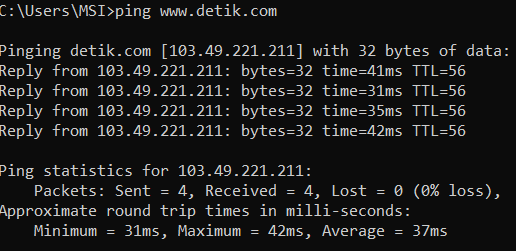
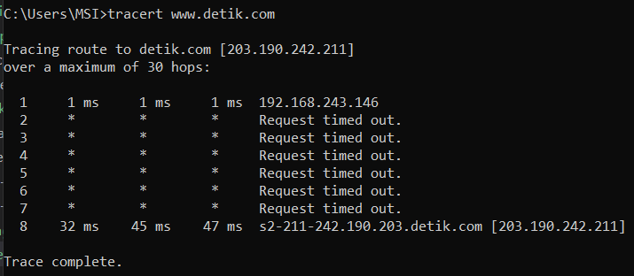

# Ping dan Traceroute
## Ping
Perintah "ping" di terminal adalah perintah yang digunakan untuk menguji konektivitas jaringan antara komputer kita (host pengirim) dengan perangkat atau host lain di jaringan (host penerima). Ini adalah perintah yang umum digunakan untuk mengukur latensi (waktu respons) antara dua perangkat dan memeriksa apakah perangkat target aktif atau tidak. Di bawah ini adalah penjelasan lebih lanjut tentang perintah "ping" di terminal:

* Tujuan Ping

Perintah "ping" memerlukan alamat IP atau nama domain dari perangkat atau host yang ingin kita uji. Misalnya, kita dapat menggunakan alamat IP atau nama domain dari server web atau komputer lain di jaringan.

* Mengirim Paket ICMP

Perintah "ping" mengirimkan serangkaian paket data ICMP (Internet Control Message Protocol) ke perangkat target. ICMP adalah protokol yang digunakan untuk mengirim pesan kontrol di jaringan.

* Respons Balik
 
Setelah paket ICMP mencapai perangkat target, perangkat tersebut akan memberikan respons balik kepada host pengirim. Respons ini mencakup informasi seperti waktu yang dibutuhkan untuk paket pergi ke tujuan dan kembali (latensi), jumlah paket yang berhasil diterima, dan statistik lainnya.

* Mengukur Konektivitas

Salah satu tujuan utama "ping" adalah untuk memeriksa apakah perangkat target aktif atau tidak. Jika perangkat aktif, kita akan mendapatkan respons balik. Jika tidak aktif, kita akan mendapatkan pesan kesalahan yang menunjukkan bahwa tujuan tidak dapat dijangkau.

* Mengukur Latensi

"Ping" juga digunakan untuk mengukur latensi atau waktu respons antara host pengirim dan perangkat target. Ini membantu dalam mengevaluasi kinerja jaringan dan mendeteksi potensi masalah konektivitas.

* Berhenti secara Manual

Kita dapat menghentikan perintah "ping" dengan menekan Ctrl + C di terminal. Ini akan menghentikan pengiriman paket ICMP dan menampilkan statistik ping saat itu.

### Contoh Penggunaan
 

 
<i>Command Ping di Terminal</i>

 

Perintah di atas akan mencoba menghubungi server yang diakses melalui nama domain "www.detik.com" dan memberikan respons balik dalam bentuk statistik ping.

## Traceroute
Perintah "tracert" (atau "traceroute" dalam beberapa sistem) di terminal adalah perintah yang digunakan untuk melacak jalur yang diambil oleh paket data dari komputer kita ke tujuan yang ditentukan di jaringan. Perintah ini membantu kita memahami semua perangkat jaringan (router) yang dilewati oleh paket data saat menuju tujuan akhir. Berikut adalah penjelasan lebih lanjut tentang perintah "tracert" di terminal:

* Tujuan Tracert
   
Perintah "tracert" memerlukan alamat IP atau nama domain dari perangkat atau host yang ingin kita telusuri jalurnya. Ini bisa berupa server web, komputer lain, atau alamat IP tertentu.

* Mengirim Paket ICMP

Perintah "tracert" mengirim serangkaian paket data ICMP (Internet Control Message Protocol) ke perangkat atau host target. Setiap paket memiliki TTL (Time to Live) yang berbeda, yang menentukan berapa banyak router yang boleh dilewati oleh paket tersebut sebelum diabaikan oleh router berikutnya.

* Melacak Jalur

Saat paket ICMP mencapai setiap router di jalur menuju tujuan, router tersebut mengurangi nilai TTL. Ketika TTL mencapai nol, router tersebut melempar paket dan memberi tahu asal-usulnya (alamat IP host pengirim).

* Mengumpulkan Informasi

Perintah "tracert" mengumpulkan informasi tentang setiap langkah di jalur, termasuk alamat IP dan nama domain dari router atau host yang dilalui, serta estimasi waktu yang diperlukan untuk mencapai masing-masing langkah.

* Menampilkan Jalur

Hasil dari perintah "tracert" adalah daftar langkah-langkah atau hop yang dilewati oleh paket data dari host pengirim ke tujuan. Ini membantu kita memahami jalur yang diambil oleh data di jaringan.

* Identifikasi Masalah

Perintah "tracert" berguna dalam pemecahan masalah jaringan. Jika ada masalah konektivitas, kita dapat melihat di mana tepatnya masalah terjadi dengan melihat hasil "tracert". Misalnya, jika ada hop yang tidak merespons atau memberikan waktu respons yang tinggi, itu bisa menjadi indikasi masalah di router tersebut.

* Berhenti secara Manual

kita dapat menghentikan perintah "tracert" dengan menekan Ctrl + C di terminal.

### Contoh Penggunaan
 

 
<i>Command Traceroute di Terminal</i>

 

Perintah di atas akan melacak jalur yang diambil oleh paket data dari komputer kita ke server yang diakses melalui nama domain "www.detik.com" dan menampilkan informasi tentang setiap hop di jalur tersebut.