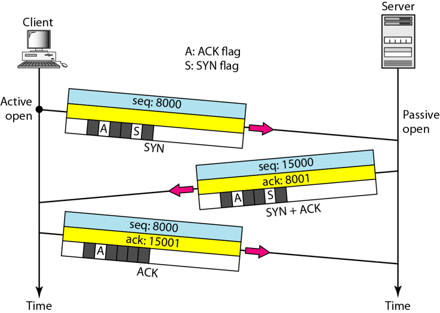

## Transmission Control Protocol

Transmission Control Protocol (TCP) adalah sebuah protokol yang berada di lapisan transport (baik itu dalam tujuh lapis model referensi OSI atau model DARPA) yang berpandangan sambungan (connection-oriented) dan dapat diandalkan (reliable). TCP dispesifikasikan dalam RFC 793.

## Segmen TCP

Segmen-segmen TCP akan dikirimkan sebagai datagram-datagram IP (datagram merupakan satuan protocol data unit pada lapisan internetwork). Sebuah segmen TCP terdiri atas sebuah header dan segmen data (payload), yang dienkapsulasi dengan memakai header IP dari protokol IP.

Sebuah segmen dapat berukuran sampai 65495 byte: 216(ukuran header IP terkecil (20 byte)+ukuran header TCP terkecil (20 byte)). Datagram IP tersebut akan dienkapsulasi lagi dengan memakai header protokol network interface (lapisan pertama dalam DARPA Reference Model) menjadi frame lapisan Network Interface. Gambar berikut mengilustrasikan data yang dikirimkan ke sebuah host.

Di dalam header IP dari sebuah segmen TCP, field Source IP Address diatur menjadi alamat unicast dari sebuah antarmuka host yang mengirimkan segmen TCP yang bersangkutan. Sementara itu, field Destination IP Address juga akan diatur menjadi alamat unicast dari sebuah antarmuka host tertentu yang dituju. Hal ini dikarenakan, protokol TCP hanya mendukung transmisi one-to-one.

## Header TCP

Ukuran dari header TCP adalah bervariasi, yang terdiri atas beberapa field yang ditunjukkan dalam gambar dan tabel berikut. Ukuran TCP header paling kecil (ketika tidak mempunyai tambahan opsi TCP) adalah 20 byte.

| Nama Field            | Ukuran          | Keterangan |
| --------------------- | --------------- | ---------- |
| Source Port           | 2 byte (16 bit) | Mengindikasikan sumber protokol lapisan aplikasi yang mengirimkan segmen TCP yang bersangkutan. Gabungan selang field Source IP Address dalam header IP dan field Source Port dalam field header TCP disebut juga sebagai socket sumber, yang berjasa sebuah alamat global dari mana segmen dikirimkan. Lihat juga Port TCP.|
| Destination Port      | 2 byte (16 bit) | Mengindikasikan tujuan protokol lapisan aplikasi yang menerima segmen TCP yang bersangkutan. Gabungan selang field Destination IP Address dalam header IP dan field Destination Port dalam field header TCP disebut juga sebagai socket tujuan, yang berjasa sebuah alamat global ke mana segmen akan dikirimkan.|
| Sequence Number       | 4 byte (32 bit) | Mengindikasikan nomor urut dari oktet pertama dari data di dalam sebuah segmen TCP yang mau dikirimkan. Field ini harus selalu diset, meskipun tidak mempunyai data (payload) dalam segmen. Ketika memulai sebuah sesi koneksi TCP, segmen dengan flag SYN (Synchronization) diset ke nilai 1, field ini akan berisi nilai Initial Sequence Number (ISN). Hal ini berjasa, oktet pertama dalam arus byte (byte stream) dalam koneksi adalah ISN+1.|
| Acknowledgment Number | 4 byte (32 bit) | Mengindikasikan nomor urut dari oktet selanjutnya dalam arus byte yang diharapkan oleh bagi diterima oleh pengirim dari si penerima pada pengiriman selanjutnya. Acknowledgment number sangat dipentingkan bagi segmen-segmen TCP dengan flag ACK diset ke nilai 1.|
| Data Offset           | 4 bit           | Mengindikasikan di mana data dalam segmen TCP dimulai. Field ini juga dapat berjasa ukuran dari header TCP. Seperti halnya field Header Length dalam header IP, field ini merupakan angka dari word 32-bit dalam header TCP. Bagi sebuah segmen TCP terkecil (di mana tidak mempunyai opsi TCP tambahan), field ini diatur ke nilai 0x5, yang berjasa data dalam segmen TCP dimulai dari oktet ke 20 diamati dari permulaan segmen TCP. Jika field Data Offset diset ke nilai maksimumnya (24=16) yakni 15, header TCP dengan ukuran terbesar dapat memiliki panjang sampai 60 byte.|
| Reserved              | 6 bit           | Direservasikan bagi digunakan pada masa hadapan. Pengirim segmen TCP akan mengeset bit-bit ini ke dalam nilai 0.|
| Flags                 | 6 bit           | Mengindikasikan flag-flag TCP yang memang mempunyai enam jumlahnya, yang terdiri atas: URG (Urgent), ACK (Acknowledgment), PSH (Push), RST (Reset), SYN (Synchronize), dan FIN (Finish).|
| Window                | 2 byte (16 bit) | Mengindikasikan jumlah byte yang tersedia yang dimiliki oleh buffer host penerima segmen yang bersangkutan. Buffer ini disebut sebagai Receive Buffer, digunakan bagi menyimpan byte stream yang datang. Dengan mengimbuhkan ukuran window ke setiap segmen, penerima segmen TCP memberitahukan kepada pengirim segmen berapa banyak data yang dapat dikirimkan dan disangga dengan berhasil. Hal ini dilakukan supaya si pengirim segmen tidak mengirimkan data banyakan dibandingkan ukuran Receive Buffer. Jika tidak mempunyai tempat lagi di dalam Receive buffer, nilai dari field ini adalah 0. Dengan nilai 0, maka si pengirim tidak akan dapat mengirimkan segmen lagi ke penerima sampai nilai field ini berubah (bukan 0). Tujuan hal ini adalah bagi mengatur lalu lintas data atau flow control.|
| Checksum              | 2 byte (16 bit) | Mampu melakukan pengecekan integritas segmen TCP (header-nya dan payload-nya). Nilai field Checksum akan diatur ke nilai 0 selama babak kalkulasi checksum.|
| Urgent Pointer        | 2 byte (16 bit) | Menandakan lokasi data yang dianggap "urgent" dalam segmen.|
| Options               | 4 byte (32 bit) | Berfungsi sebagai penampung beberapa opsi tambahan TCP. Setiap opsi TCP akan memakan ruangan 32 bit, sehingga ukuran header TCP dapat diindikasikan dengan memakai field Data offset.|

## Port TCP
Port TCP mampu mengindikasikan sebuah lokasi tertentu bagi menyampaikan segmen-segmen TCP yang dikirimkan yang diidentifikasi dengan TCP Port Number. Nomor-nomor di bawah angka 1024 merupakan port yang umum digunakan dan dipastikan oleh IANA (Internet Assigned Numbers Authority), sementara port UDP merepresentasikan sebuah antrean pesan UDP bagi protokol lapisan aplikasi. Selain itu, protokol lapisan aplikasi yang memakai port TCP dan port UDP dalam nomor yang sama juga tidak harus sama. Sebagai contoh protokol Extended Filename Server (EFS) memakai port TCP dengan nomor 520, dan protokol Routing Information Protocol (RIP) memakai port UDP juga dengan nomor 520. Jelas, dua protokol tersebut sangatlah berbeda! Karenanya, bagi menyebutkan sebuah nomor port, sebutkan juga jenis port yang digunakannya, karena hal tersebut mampu membingungkan (ambigu).

## Flag TCP
Sebuah segmen TCP dapat memiliki flag (tanda-tanda) khusus yang mengindikasikan segmen yang bersangkutan, seperti yang dikatakan dalam tabel berikut:

 

 
<i>Segmen TCP</i>

 

| Flag | Keterangan |
| -------- | ------- |
| URG | Mengindikasikan bahwa beberapa bidang dari segmen TCP mengandung data yang sangat penting, dan field Urgent Pointer dalam header TCP harus digunakan bagi memilihkan lokasi di mana data penting tersebut berada dalam segmen. |
| ACK | Mengindikasikan field Acknowledgment mengandung oktet selanjutnya yang diharapkan dalam koneksi. Flag ini selalu diset, kecuali pada segmen pertama pada pembuatan sesi koneksi TCP. |
| PSH | Mengindikasikan bahwa inti dari TCP Receive buffer harus diserahkan kepada protokol lapisan aplikasi. Data dalam receive buffer harus berisi sebuah blok data yang berurutan (kontigu), diamati dari ujung paling kiri dari buffer. Dengan kata lain, sebuah segmen yang memiliki flag PSH diset ke nilai 1, tidak bolah mempunyai satu byte pun data yang lenyap dari arus byte segmen tersebut; data tidak dapat diberikan kepada protokol lapisan aplikasi sampai segmen yang lenyap tersebut datang. Normalnya, TCP Receive buffer akan dikosongkan (dengan kata lain, inti dari buffer akan diteruskan kepada protokol lapisan aplikasi) ketika buffer tersebut berisi data yang kontigu atau ketika dalam "proses perawatan". Flag PSH ini dapat mengubah hal seperti itu, dan membikin akan TCP segera mengosongkan TCP Receive buffer. Flag PSH umumnya digunakan dalam protokol lapisan aplikasi yang bersifat interaktif, seperti halnya Telnet, karena setiap penekanan tombol dalam sesi terminal virtual akan dikirimkan dengan sebuah flag PSH diset ke nilai 1. Contoh dari penggunaan lainnya dari flag ini adalah pada segmen terakhir dari berkas yang ditransfer dengan memakai protokol FTP. Segmen yang dikirimkan dengan flag PSH aktif tidak harus segera di-acknowledge oleh penerima. |
| RST | Mengindikasikan bahwa koneksi yang diciptakan akan digagalkan. Bagi sebuah koneksi TCP yang sedang berlanjut (aktif), sebuah segmen dengan flag RST diset ke nilai 1 akan dikirimkan sebagai respons terhadap sebuah segmen TCP yang diterima yang ternyata segmen tersebut bukan yang dimohon, sehingga koneksi pun menjadi gagal. Pengiriman segmen dengan flag RST diset ke nilai 1 bagi sebuah koneksi aktif akan menutup koneksi secara paksa, sehingga data yang disimpan dalam buffer akan dibuang (dihilangkan). Bagi sebuah koneksi TCP yang sedang diciptakan, segmen dengan flag RST aktif akan dikirimkan sebagai respons terhadap request pembuatan koneksi bagi mencegah percobaan pembuatan koneksi. |
| SYN | Mengindikasikan bahwa segmen TCP yang bersangkutan mengandung Initial Sequence Number (ISN). Selama babak pembuatan sesi koneksi TCP, TCP akan mengirimkan sebuah segmen dengan flag SYN diset ke nilai 1. Setiap host TCP lainnya akan memberikan jawaban (acknowledgment) dari segmen dengan flag SYN tersebut dengan menganggap bahwa segmen tersebut merupakan sekumpulan byte dari data. Field Acknowledgment Number dari sebuah segmen SYN diatur ke nilai ISN + 1. |
| FIN | Menandakan bahwa pengirim segmen TCP telah selesai dalam mengirimkan data dalam sebuah koneksi TCP. Ketika sebuah koneksi TCP yang belakang sekalinya dihentikan (akibat sudah tidak mempunyai data yang dikirimkan lagi), setiap host TCP akan mengirimkan sebuah segmen TCP dengan flag FIN diset ke nilai 1. Sebuah host TCP tidak akan mengirimkan segmen dengan flag FIN sampai semua data yang dikirimkannya telah diterima dengan patut (menerima paket acknowledgment) oleh penerima. Setiap host akan menganggap sebuah segmen TCP dengan flag FIN sebagai sekumpulan byte dari data. Ketika dua host TCP telah mengirimkan segmen TCP dengan flag FIN dan menerima acknowledgment dari segmen tersebut, maka koneksi TCP pun akan dihentikan. |

## Three-way Handshake
Babak pembuatan koneksi TCP disebut juga dengan "Three-way Handshake". Tujuan metode ini adalah supaya dapat melakukan sinkronisasi terhadap nomor urut dan nomor acknowledgement yang dikirimkan oleh kedua pihak dan saling bertukar ukuran TCP Window. Babaknya dapat digambarkan sebagai berikut:

 

 
<i>Three-way Handshake</i>

 

* Langkah 1 (SYN)

Pada langkah pertama, klien ingin membangun koneksi dengan server, sehingga mengirimkan segmen dengan SYN (Synchronize Sequence Number) yang memberi tahu server bahwa klien kemungkinan akan memulai komunikasi dan dengan nomor urutan apa segmen-segmen tersebut dimulai.

* Langkah 2 (SYN + ACK)

Server merespons permintaan klien dengan sinyal bit SYN-ACK. Acknowledgement (ACK) menandakan respon dari segmen yang diterimanya dan SYN menandakan dengan nomor urutan apa server kemungkinan akan memulai segmen-segmen tersebut.

* Langkah 3 (ACK)

Pada bagian akhir, klien mengakui respon dari server dan keduanya membangun koneksi yang dapat diandalkan dengan mana mereka akan memulai transfer data sebenarnya.

TCP memakai babak jabat tangan yang sama bagi mengakhiri koneksi yang diciptakan. Hal ini menjamin dua host yang sedang terkoneksi tersebut telah menyelesaikan babak transmisi data dan semua data yang ditransmisikan telah diterima dengan patut. Itulah sebabnya, mengapa TCP disebut dengan koneksi yang reliable.
