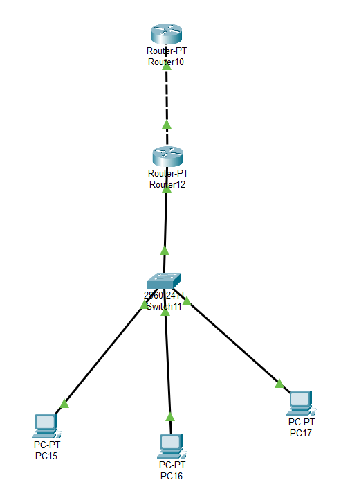

## Table of Contents

- [Table of Contents](#table-of-contents)
- [Physical Design](#physical-design)
  - [**1. Router 0**](#1-router-0)
  - [**2. Router 1**](#2-router-1)
  - [**3. PC 0**](#3-pc-0)
  - [**4. PC 1**](#4-pc-1)
  - [**5. PC 2**](#5-pc-2)
- [Winbox](#winbox)

## Physical Design

### **1. Router 0**
    - Static
        Network     : 192.168.1.0
        Mask        : 255.255.255.0
        Next Hop    : 10.252.108.11
    - Fe 0/0
        IPv4 Address: 10.252.108.1
        Subnet Mask : 255.0.0.0

### **2. Router 1**
    - Fe 0/0
        IPv4 Address: 10.252.108.11
        Subnet Mask : 255.0.0.0
    - Fe 1/0
        IPv4 Address: 192.168.1.1
        Subnet Mask : 255.255.255.0

### **3. PC 0**
    IPv4 Address    : 192.168.1.2
    Subnet Mask     : 255.255.255.0
    Default Gateway : 192.168.1.1

### **4. PC 1**
    IPv4 Address    : 192.168.1.3
    Subnet Mask     : 255.255.255.0
    Default Gateway : 192.168.1.1

### **5. PC 2**
    IPv4 Address    : 192.168.1.4
    Subnet Mask     : 255.255.255.0
    Default Gateway : 192.168.1.1

## Winbox
.png)

.png)

.png)

.png)

.png)

.png)

.png)

.png)

.png)

.png)

.png)

.png)

.png)

.png)

.png)

.png)

.png)

.png)

.png)

.png)

.png)

.png)

.png)

.png)

.png)

.png)

.png)

.png)

.png)

.png)

.png)