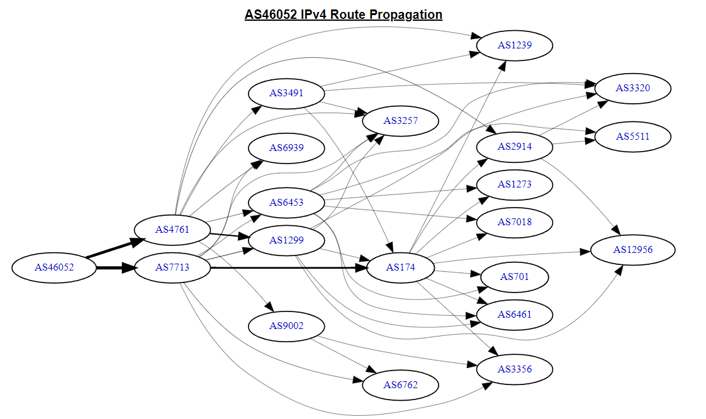
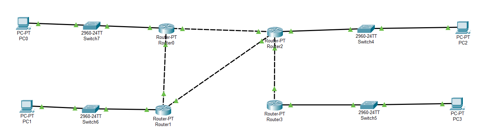
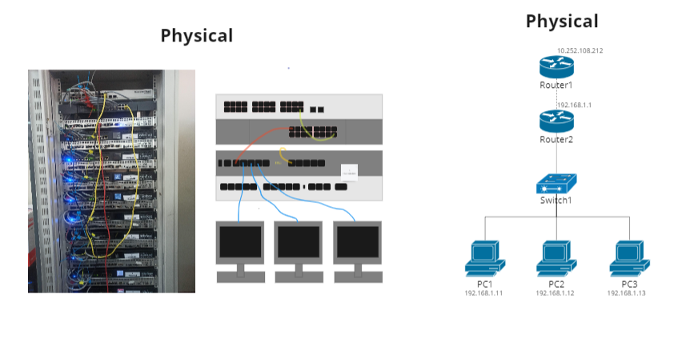
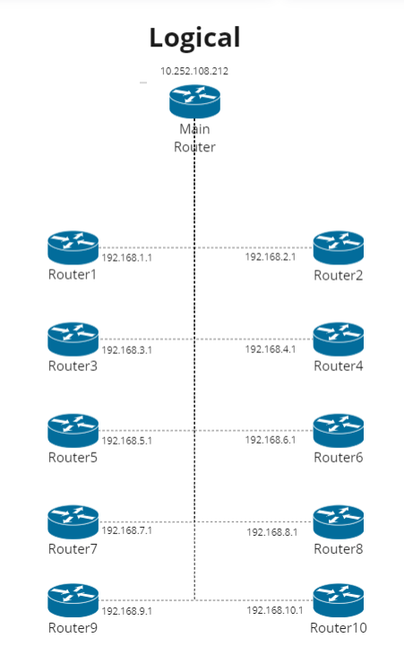
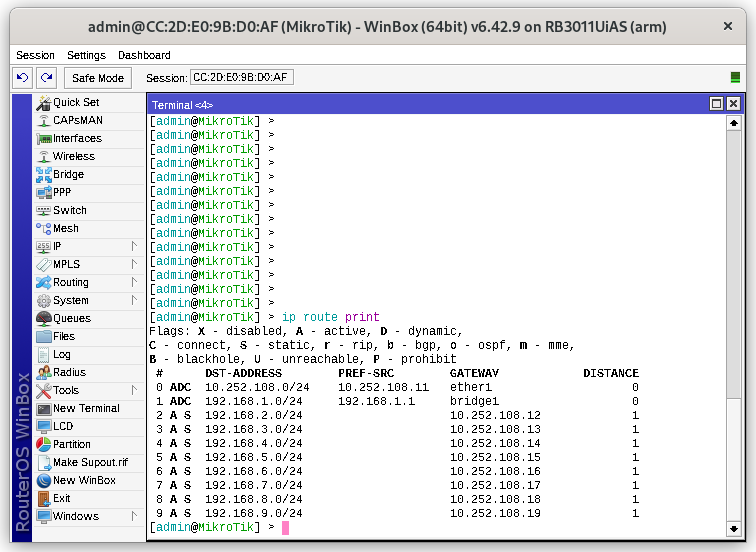

## Table of Contents

- [Table of Contents](#table-of-contents)
- [Routing](#routing)
- [Subnetting](#subnetting)
  - [**1. Router 0**](#1-router-0)
  - [**2. Router 1**](#2-router-1)
  - [**3. Router 2**](#3-router-2)
  - [**4. Router 3**](#4-router-3)
  - [**5. PC 0**](#5-pc-0)
  - [**6. PC 1**](#6-pc-1)
  - [**7. PC 2**](#7-pc-2)
  - [**8. PC 3**](#8-pc-3)
- [Ping antar PC di Winbox](#ping-antar-pc-di-winbox)
- [Gambar Physical](#gambar-physical)
- [Gambar Logical](#gambar-logical)
- [Routing Table di Winbox](#routing-table-di-winbox)

## Routing

*Routing* dibagi menjadi 2, yaitu *Static* dan *Dynamic*.
1. **Static Routing**:

-   Static routing melibatkan konfigurasi manual dan statis dari tabel routing di perangkat jaringan. Ini berarti administrator jaringan harus secara eksplisit menentukan rute lalu lintas, yaitu jalur yang akan diikuti oleh paket data dari satu perangkat atau subnet ke perangkat atau subnet lain.
-   Tabel routing statis harus diperbarui secara manual setiap kali ada perubahan dalam topologi jaringan. Ini bisa menjadi pilihan yang baik untuk jaringan kecil yang memiliki sedikit perubahan dalam struktur atau rute.
-   Keuntungan dari static routing adalah bahwa ini sederhana, efisien, dan dapat memberikan kontrol yang lebih besar atas rute lalu lintas. Namun, itu tidak efisien untuk jaringan besar atau yang berubah secara dinamis.

2. **Dynamic Routing**:

-   Dynamic routing, sebaliknya, melibatkan penggunaan protokol routing yang memungkinkan perangkat jaringan untuk berkomunikasi satu sama lain dan secara otomatis mengganti tabel routing saat terjadi perubahan dalam jaringan.
-   Protokol routing dinamis seperti RIP (Routing Information Protocol), OSPF (Open Shortest Path First), dan BGP (Border Gateway Protocol) digunakan untuk mengirim informasi tentang rute yang ada dan memungkinkan perangkat jaringan untuk secara otomatis memutakhirkan tabel routing mereka.
-   Dynamic routing lebih cocok untuk jaringan yang besar dan kompleks, di mana perubahan dalam topologi jaringan atau kegagalan perangkat harus diatasi dengan cepat. Hal ini juga memungkinkan untuk membagi beban lalu lintas secara efisien di seluruh jaringan.

Pada *Routing* terdapat sebutan *Edge Router* dan *Core Router*. 
1. **Edge Router**:

-   Edge router, juga dikenal sebagai router perbatasan atau router akses, berada di tepi (edge) jaringan dan menghubungkan jaringan lokal dengan jaringan luar, seperti Internet atau jaringan lainnya.
-   Peran utama edge router adalah menghubungkan perangkat dalam jaringan lokal Anda dengan sumber daya di luar jaringan, seperti server web, layanan cloud, atau jaringan lain melalui protokol seperti BGP, OSPF, atau RIP.
-   Edge router juga bertanggung jawab untuk mengelola masalah keamanan, seperti firewalling, NAT (Network Address Translation), dan implementasi kebijakan keamanan.

2. **Core Router**:

-   Core router, juga dikenal sebagai router inti, berada di dalam jaringan dan digunakan untuk menghubungkan jaringan-jaringan dalam infrastruktur jaringan yang lebih besar.
-   Core router bertanggung jawab untuk mengarahkan lalu lintas data di dalam jaringan dan memutuskan jalur yang paling efisien untuk mengirim data antara berbagai jaringan atau subnet.
-   Mereka biasanya terletak di pusat jaringan dan digunakan untuk mengelola lalu lintas data dalam skala yang sangat besar. Core router harus memiliki kapasitas pemrosesan yang tinggi dan sangat andal.

Router PENS:

## Subnetting

### **1. Router 0**
    - Static
        Network     : 192.168.1.0
        Mask        : 255.255.255.192
        Next Hop    : 192.168.10.14
    - Static
        Network     : 192.168.3.0
        Mask        : 255.255.255.240
        Next Hop    : 192.168.10.9
    - Fe 0/0 (ke Router 2)
        IPv4 Address: 192.168.10.13
        Subnet Mask : 255.255.255.252
    - Fe 1/0 (ke Router 1)
        IPv4 Address: 192.168.10.10
        Subnet Mask : 255.255.255.252
    - Fe 6/0 (ke Switch -> PC)
        IPv4 Address: 192.168.4.1
        Subnet Mask : 255.255.255.192

### **2. Router 1**
    - Static
        Network     : 192.168.4.0
        Mask        : 255.255.255.192
        Next Hop    : 192.168.10.10
    - Static
        Network     : 192.168.1.0
        Mask        : 255.255.255.240
        Next Hop    : 192.168.10.5
    - Fe 0/0 (ke Router 0)
        IPv4 Address: 192.168.10.9
        Subnet Mask : 255.255.255.252
    - Fe 1/0 (ke Router 2)
        IPv4 Address: 192.168.10.6
        Subnet Mask : 255.255.255.252
    - Fe 6/0 (ke Switch -> PC)
        IPv4 Address: 192.168.3.1
        Subnet Mask : 255.255.255.192

### **3. Router 2**
    - Static
        Network     : 192.168.4.0
        Mask        : 255.255.255.192
        Next Hop    : 192.168.10.13
    - Static
        Network     : 192.168.2.0
        Mask        : 255.255.255.224
        Next Hop    : 192.168.10.1
    - Static
        Network     : 192.168.3.0
        Mask        : 255.255.255.192
        Next Hop    : 192.168.10.6
    - Fe 0/0 (ke Router 0)
        IPv4 Address: 192.168.10.14
        Subnet Mask : 255.255.255.252
    - Fe 1/0 (ke Router 1)
        IPv4 Address: 192.168.10.5
        Subnet Mask : 255.255.255.252
    - Fe 6/0 (ke Router 3)
        IPv4 Address: 192.168.10.2
        Subnet Mask : 255.255.255.252
    - Fe 7/0 (ke Switch -> PC)
        IPv4 Address: 192.168.1.1
        Subnet Mask : 255.255.255.240

### **4. Router 3**
    - Static
        Network     : 192.168.1.0
        Mask        : 255.255.255.240
        Next Hop    : 192.168.10.2
    - Fe 0/0 (ke Router 2)
        IPv4 Address: 192.168.10.1
        Subnet Mask : 255.255.255.252
    - Fe 1/0 (ke Switch -> PC)
        IPv4 Address: 192.168.2.1
        Subnet Mask : 255.255.255.224

### **5. PC 0**
    IPv4 Address    : 192.168.4.3
    Subnet Mask     : 255.255.255.192
    Default Gateway : 192.168.4.1

### **6. PC 1**
    IPv4 Address    : 192.168.3.3
    Subnet Mask     : 255.255.255.192
    Default Gateway : 192.168.3.1

### **7. PC 2**
    IPv4 Address    : 192.168.1.3
    Subnet Mask     : 255.255.255.240
    Default Gateway : 192.168.1.1

### **8. PC 3**
    IPv4 Address    : 192.168.2.3
    Subnet Mask     : 255.255.255.224
    Default Gateway : 192.168.2.1

## Ping antar PC di Winbox

.png)

.png)

.png)

.png)

.png)

.png)

.png)

.png)

## Gambar Physical

## Gambar Logical

## Routing Table di Winbox

