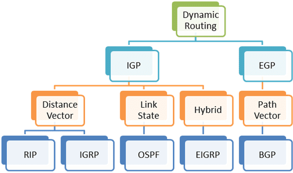
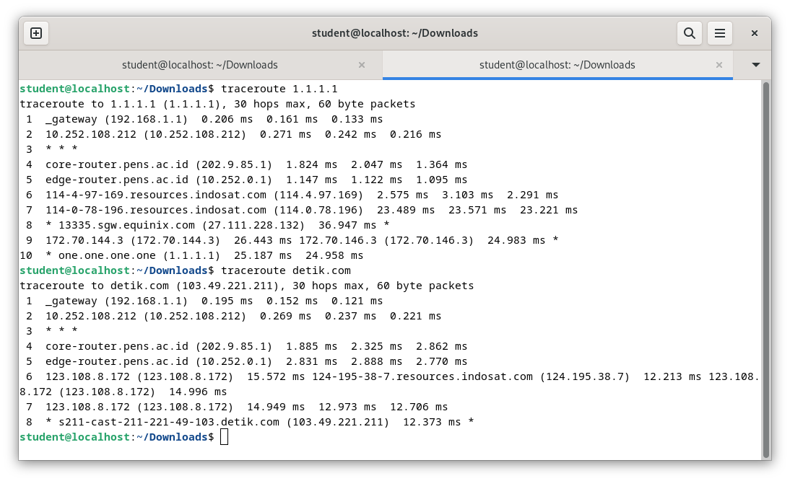

# Week 12

## Table of Contents

- [Week 12](#week-12)
  - [Table of Contents](#table-of-contents)
  - [Dynamic Routing](#dynamic-routing)
    - [Pengertian](#pengertian)
    - [Kelebihan](#kelebihan)
    - [Kekurangan](#kekurangan)
    - [Jenis Protokol](#jenis-protokol)
      - [RIP (Routing Information Protocol)](#rip-routing-information-protocol)
        - [Kelebihan](#kelebihan-1)
        - [Kekurangan](#kekurangan-1)
      - [IGRP (Interior Gateway Routing Protocol)](#igrp-interior-gateway-routing-protocol)
        - [Kelebihan](#kelebihan-2)
        - [Kekurangan](#kekurangan-2)
      - [OSPF (Open Short Path First)](#ospf-open-short-path-first)
        - [Kelebihan](#kelebihan-3)
        - [Kekurangan](#kekurangan-3)
      - [EIGRP (Enhanced Interior Gateway Routing Protocol)](#eigrp-enhanced-interior-gateway-routing-protocol)
        - [Kelebihan](#kelebihan-4)
        - [Kekurangan](#kekurangan-4)
      - [BGP (Border Gateway Protocol)](#bgp-border-gateway-protocol)
        - [Kelebihan](#kelebihan-5)
        - [Kekurangan](#kekurangan-5)
  - [Traceroute 1.1.1.1 dan www.detik.com](#traceroute-1111-dan-wwwdetikcom)
    - [1.1.1.1](#1111)
    - [www.detik.com (103.49.221.211):](#wwwdetikcom-10349221211)
    - [Analisis:](#analisis)

## Dynamic Routing

### Pengertian
Routing adalah sebuah proses untuk meneruskan paket-paket jaringan dari satu jaringan ke jaringan lainnya melalui sebuah internetwork. Routing juga dapat merujuk kepada sebuah metode penggabungan beberapa jaringan sehingga paket-paket data dapat hinggap dari satu jaringan ke jaringan selanjutnya. Untuk melakukan hal ini, digunakanlah sebuah perangkat jaringan yang disebut sebagai router. Router- router tersebut akan menerima paket-paket yang ditujukan ke jaringan di luar jaringan yang pertama, dan akan meneruskan paket yang ia terima kepada router lainnya hingga sampai kepada tujuannya.

Routing protokol berbeda dengan router protokol. Routing protokol adalah komunikasi antara router. Routing protokol mengijinkan router untuk sharing informasi tentang jaringan dan koneksi antar router. Router menggunakan informasi ini untuk membangun dan memperbaiki tabel routingnya. Ada beberapa dynamic routing untuk IP.

Protokol ini didesain untuk mendistribusikan informasi yang secara dinamis mengikuti perubahan kondisi jaringan. Protokol routing mengatasi situasi routing yang kompleks secara cepat dan akurat. Protokol routing didesain tidak hanya untuk mengubah ke rute backup bila rute utama tidak berhasil, namun juga didesain untuk menentukan rute mana yang terbaik untuk mencapai tujuan tersebut. Pengisian dan pemeliharaan tabel routing tidak dilakukan secara manual oleh admin. Router saling bertukar informasi routing agar dapat mengetahui alamat tujuan dan menerima tabel routing. Pemeliharaan jalur dilakukan oleh Routing Dynamic.

Dynamic routing adalah sebuah metode dalam jaringan komputer di mana perangkat jaringan secara otomatis memutuskan jalur terbaik untuk mengirim data berdasarkan informasi yang diperoleh secara dinamis dari jaringan. Dalam konteks ini, "dinamis" berarti bahwa konfigurasi jaringan dapat berubah seiring waktu karena berbagai faktor, seperti perubahan topologi jaringan, kepadatan lalu lintas, atau kegagalan perangkat jaringan. Dynamic routing menggunakan protokol routing khusus yang memungkinkan perangkat jaringan untuk berkomunikasi dan bertukar informasi tentang keadaan jaringan secara teratur.

### Kelebihan
* Cocok untuk area besar/luas
* Hanya mengenalkan alamat yang terhubung langsung dengan routernya
* Bila terjadi penambahan suatu network baru tidak perlu semua router dikonfigurasi, hanya router yang berkaitan saja
* Router secara otomatis berbagi informasi
* Routing table dibuat secara dinamis
* Tidak perlu mengetahui semua alamat network yang ada
* Administrator tidak ikut campur tangan

### Kekurangan
* Beban kerja router menjadi lebih berat karena selalu memperbarui IP table pada setiap waktu tertentu
* Kecepatan pengenalan dan kelengkapan IP table memakan waktu lama karena router akan melakukan broadcast ke semua router sampai ada IP table yang cocok. Setelah konfigurasi selesai, router harus menunggu beberapa saat agar setiap router mendapat semua alamat IP yang tersedia.

### Jenis Protokol
#### RIP (Routing Information Protocol)
RIP merupakan protokol yang memberikan routing table berdasarkan router yang terhubung langsung. Lalu, router selanjutnya akan memberikan informasi ke router selanjutnya yang terhubung langsung dengan router tersebut. Adapun informasi yang diberikan dalam protokol RIP yaitu: host, network, subnet, dan route default.

Routing ini menggunakan algoritma distance vector. Metric yang dilakukan berdasarkan hop count untuk pemilihan jalur terbaik. Jika hop count lebih dari 15, maka paket datagram akan dibuang. Update routing akan dilakukan secara broadcast setiap 30 detik.

RIP terbagi menjadi dua bagian, yaitu:

1. RIPv1 (RIP versi 1)
* Hanya mendukung routing class-full
* Tidak ada info subnet yang dimasukkan dalam data perbaikan routing
* Tidak mendukung VLSM (Variabel Length Subnet Mask)
Adanya fitur perbaikan routing broadcast

2. RIPv2 (RIP versi 2)
* Mendukung routing class-full dan class-less
* Info subnet dimasukkan dalam data perbaikan routing
* Mendukung VLSM (Variabel Length Subnet Mask)
* Perbaikan routing multicast

Secara umum, RIPv2 tidak berbeda jauh dengan RIPv1. Perbedaan yang ada terlihat pada informasi yang diberikan antar router. Pada RIPv2, informasi yang dipertukarkan terdapat autentifikasi. Masih ada persamaan RIPv2 lainnya dengan RIPv1, di antaranya:
* Distance Vector Routing Protocol
* Metric berupa hop count
* Max hop count adalah 15
* Menggunakan port 520
* Menjalankan auto summary secara default

Sedangkan perbedaan RIPv2 dengan RIPv1 adalah sebagai berikut:
* Bersifat class-less routing protocol, yang berarti RIPv2 menyertakan field SM dalam paket update yang dikirimkan sehingga RIPv2 dapat mendukung VLSM & CIDR
* Mengirimkan paket update & menerima paket update versi 2
* Mengirimkan update ke alamat multicast yaitu 224.0.0.9
* Auto Summary dapat dinonaktifkan
* Mendukung fungsi keamanan berupa authentication, yang dapat mencegah routing update dikirim/diterima dari sumber yang tidak dipercaya

##### Kelebihan
1. Menggunakan metode “Triggered Update”.
2. Memiliki timer untuk mengetahui kapan router harus kembali memberikan informasi routing.
3. Jika terjadi perubahan pada jaringan, sementara waktu pada timer belum habis, router tetap harus mengirimkan informasi routing karena dipicu oleh perubahan tersebut (triggered update).
4. Mengatur routing menggunakan RIP tidak rumit dan memberikan hasil yang cukup dapat diterima, terlebih jika jarang terjadi kegagalan link pada jaringan.

##### Kekurangan
1. Jumlah host yang terbatas.
2. Tidak memiliki informasi tentang subnet setiap route.
3. Tidak mendukung Variable Length Subnet Masking (VLSM).
4. Ketika pertama kali dijalankan, RIP hanya mengetahui cara routing ke dirinya sendiri (informasi lokal/localhost) dan tidak mengetahui topologi jaringan tempatnya berada.

#### IGRP (Interior Gateway Routing Protocol)
IGRP adalah sebuah routing protocol yang dikembangkan pada pertengahan tahun 1980-an oleh Cisco Systems Inc. Tujuan utama penciptaan IGRP adalah untuk menyediakan protokol yang kuat untuk routing dalam sistem otonomi. IGRP memiliki hop maksimum 255, tetapi defaultnya sendiri adalah 100. IGRP menggunakan bandwidth dan garis menunda secara default untuk menentukan rute terbaik dalam sebuah internetwork (Composite Metrik). Protokol routing ini menggunakan algoritma distance vector. IGRP menggunakan composite metric yang terdiri atas bandwidth, load, delay dan reliability. Update routing dilakukan secara broadcast setiap 90 detik.

Pada IGRP, routing dilakukan secara matematik berdasarkan jarak. Untuk itu, sistem IGRP sudah mempertimbangkan beberapa hal sebelum mengambil keputusan jalur mana yang akan ditempuh. Adapun hal yang harus diperhatikan tersebtu diantaranya: load, delay, bandwitdh, realibility. Karena protocol ini diciptakan oleh Cisco, maka di dalam kumpulan perintah dasar Cisco terdapat perintah untuk mengatur protokol ini.

##### Kelebihan
1. Mendukung sampai 255 hop count

##### Kekurangan
1. Jumlah host yang terbatas
2. Produk Cisco

#### OSPF (Open Short Path First)
OSPF adalah sebuah routing protocol standar terbuka yang telah diaplikasikan oleh sejumlah vendor jaringan dan dijelaskan di RFC 2328. Jika Anda memiliki banyak router, dan tidak semuanya adalah router Cisco, maka Anda tidak dapat menggunakan IGRP. jadi pilihan Anda tinggal RIP v1, RIP v2, atau OSPF. Jika jaringan yang dikelola adalah jaringan besar, maka OSPF adalah pilihan satu-satunya. OSPF ini adalah sesuatu yang disebut route redistribution, yaitu sebuah layanan penerjemah antar routing protocol.

OSPF bekerja dengan sebuah algoritma link-state yang disebut algoritma Dijkstra / SPF. Cara kerja dari protokol ini adalah: Pertama, sebuah “pohon” dengan jalur terpendek akan dibangun. Kemudian, routing table akan diisi dengan jalur-jalur terbaik yang dihasilkan dari “pohon” tersebut. OSPF hanya mendukung routing IP saja. Update routing akan dilakukan secara floaded saat terjadi perubahan topologi jaringan.

##### Kelebihan
1. Tidak menghasilkan routing loop
2. Mendukung penggunaan beberapa metrik sekaligus
3. Bisa menghasilkan banyak jalur ke sebuah tujuan membagi jaringan yang besar mejadi beberapa area
4. Waktu yang diperlukan untuk konvergen lebih cepat.

##### Kekurangan
1. Membutuhkan basis data yang besar.
2. Lebih rumit.

#### EIGRP (Enhanced Interior Gateway Routing Protocol)
Protokol routing ini menggunakan algoritma advanced distance vector dan menggunakan cost load balancing yang tidak sama. Algoritma yang dipakai adalah kombinasi antara distance vector dan link-state, serta menggunakan Diffusing Update Algorithm (DUAL) untuk menghitung jalur terpendek.
Distance vector protocol merawat satu set metric yang kompleks untuk jarak tempuh ke jaringan lainnya.

Broadcast-broadcast EIGRP di-update setiap 90 detik ke semua router EIGRP yang berdekatan. Setiap update hanya memasukkan perubahan jaringan. EIGRP sangat cocok untuk diterapkan pada jaringan komputer yang besar. IGRP dan EIGRP sama-sama sudah mempertimbangkan masalah bandwitdh yang ada dan delay yang terjadi.

##### Kelebihan
1. Melakukan konvergensi secara tepat ketika menghindari loop.
2. Memerlukan lebih sedikit memori dan proses.
3. Adanya fitur "loop avoidance".

##### Kekurangan
1. Hanya dapat digunakan untuk Router Cisco

#### BGP (Border Gateway Protocol)
BGP merupakan salah satu jenis routing protocol yang ada di dunia komunikasi data. Sebagai routing protocol, BGP memiliki kemampuan untuk melakukan pengumpulan rute, pertukaran rute dan menentukan rute terbaik menuju ke sebuah lokasi dalam sebuah jaringan. Routing protocol juga pasti dilengkapi dengan algoritma yang pintar dalam mencari jalan terbaik. Namun yang membedakan BGP dengan routing protocol lain adalah BGP termasuk ke dalam kategori routing protocol jenis Exterior Gateway Protocol (EGP). 

BGP merupakan “distance vector exterior gateway protocol” yang bekerja secara cerdas untuk merawat path-path ke jaringan lainnya. Update-update akan dikirim melalui koneksi TCP. Protokol ini biasa digunakan antara ISP dengan ISP dan atau antara client dengan client lainnya. Dalam implementasinya, protokol ini digunakan untuk membuat rute dari trafik internet antar autonomous system.

##### Kelebihan
1. Sangat sederhana dalam instalasi

##### Kekurangan
1. Sangat terbatas dalam mempergunakan topologi jaringan

## Traceroute 1.1.1.1 dan www.detik.com

### 1.1.1.1

1. 192.168.1.1 (Gateway):

Langkah pertama menunjukkan local gateway (192.168.1.1) dengan waktu tempuh yang singkat, menunjukkan jarak yang dekat.

2. 10.252.108.212:

Langkah kedua menunjukkan alamat jaringan internal (10.252.108.212) dengan waktu tempuh yang rendah.

3. core-router.pens.ac.id (202.9.85.1) dan edge-router.pens.ac.id (10.252.0.1):

Langkah 5 dan 6 menunjukkan router di PENS (Politeknik Elektronika Negeri Surabaya) dengan waktu tempuh yang sedang.

4. 114-4-97-169.resources.indosat.com (114.4.97.169) dan 114-0-78-196.resources.indosat.com (114.0.78.196):

Langkah 6 dan 7 menunjukkan node jaringan milik Indosat, perusahaan telekomunikasi Indonesia.

5. 13335.sgw.equinix.com (27.111.228.132):

Langkah 7 menunjukkan node di Equinix Singapore dengan waktu tempuh yang lebih tinggi.

6. 172.70.144.3 dan 172.70.146.3:

Langkah 10 dan 11 menunjukkan server DNS Cloudflare (1.1.1.1) dengan waktu tempuh.

### www.detik.com (103.49.221.211):
1. 192.168.1.1 (Gateway) dan 10.252.108.212:

Langkah 1 dan 2 mirip dengan penelusuran sebelumnya.

2. core-router.pens.ac.id (202.9.85.1) dan edge-router.pens.ac.id (10.252.0.1):

Langkah 5 dan 6 menunjukkan router di PENS dengan waktu tempuh.

3. 123.108.8.172:

Langkah 7 dan 8 menunjukkan node dengan alamat IP 123.108.8.172.

4. 124.195.38.7:

Langkah 9 dan 10 menunjukkan node milik Indosat dengan waktu tempuh.

5. s211-cast-211-221-49-103.detik.com (103.49.221.211):

Langkah terakhir menunjukkan alamat IP tujuan untuk www.detik.com.

### Analisis:
Kedua traceroute mengikuti jalur yang mirip melalui jaringan lokal, router PENS, node Indosat, dan akhirnya mencapai tujuan masing-masing.
Waktu tempuh berbeda di setiap langkah, dengan beberapa node menunjukkan latensi yang lebih tinggi, yang normal dalam penyebaran internet.
Trace route memberikan wawasan tentang infrastruktur jaringan dan titik potensial keterlambatan dalam mencapai tujuan.

