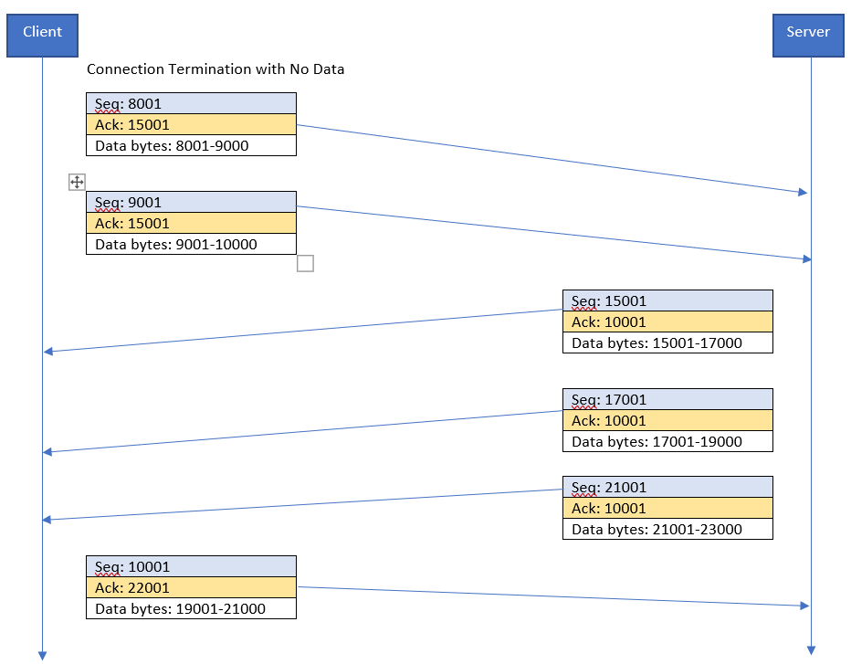
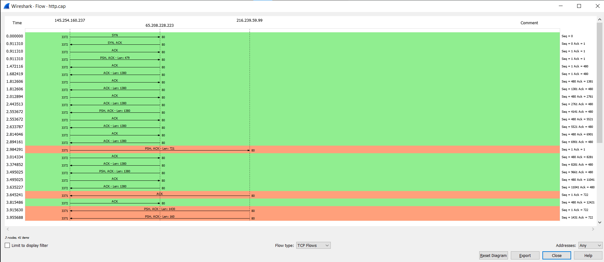
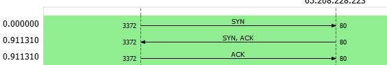
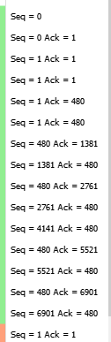
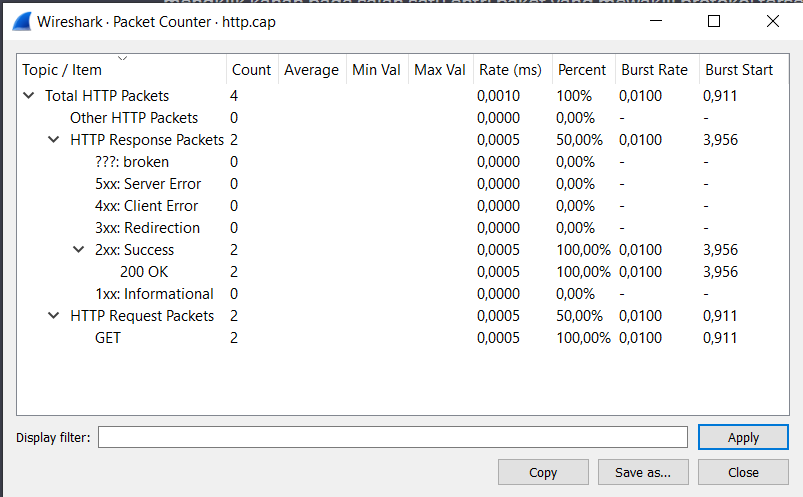
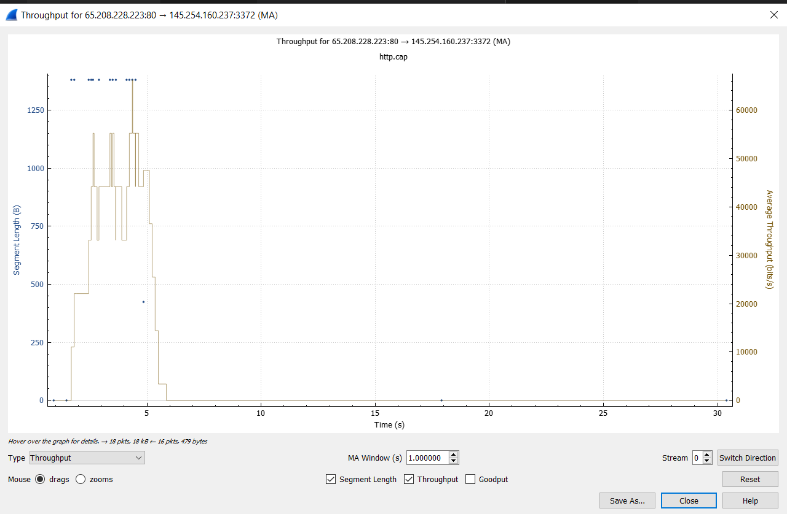
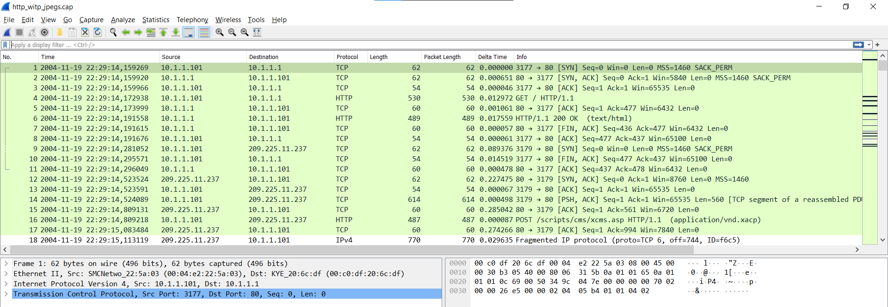
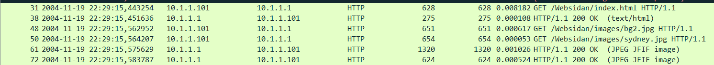
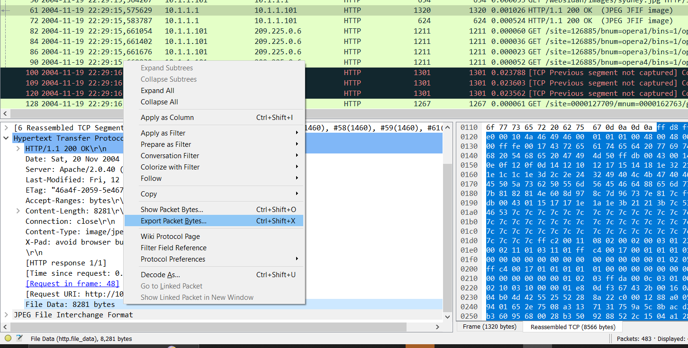
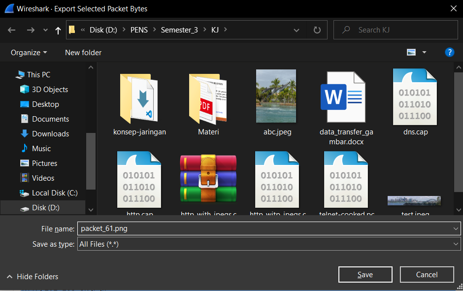

# Analisis di Wireshark
## Daftar Isi

- [Analisis di Wireshark](#analisis-di-wireshark)
  - [Daftar Isi](#daftar-isi)
  - [Gambar Connection Termination Tanpa Data](#gambar-connection-termination-tanpa-data)
  - [Analisis Flow Graph dari Request HTTP](#analisis-flow-graph-dari-request-http)
  - [Penjelasan Packet Counter](#penjelasan-packet-counter)
    - [Field di Packet Counter](#field-di-packet-counter)
  - [Throughput](#throughput)
  - [Mengambil Gambar di http\_witp\_jpegs.cap](#mengambil-gambar-di-http_witp_jpegscap)

## Gambar Connection Termination Tanpa Data
 

 
<i>Connection Termination Tanpa Data</i>

 

## Analisis Flow Graph dari Request HTTP
 

 
<i>Flow Graph</i>

 
Buka Flow Graph dengan menekan Statistics -> Flow Graph di toolbar. Lalu pilih Flow type menjadi TCP Flows. Di sini, kita bisa melihat step yang dijalankan.
 

 
<i>Three-way Handshake</i>

 
Terlihat bahwa pada proses ini terjadi Three-way Handshake untuk Connection Establishment.
 

 
<i>Seq Ack Information</i>

 
Lalu di sisi kanan juga terlihat informasi mengenai data Seq dan Ack.

## Penjelasan Packet Counter
 

 
<i> Packet Counter</i>

 

Kita bisa melihat statistik dari file http.cap dengan mengklik Statistics -> HTTP -> Packet Counter di toolbar. Berikut adalah informasi yang ada di dalam Packet Counter:
* Total Packets: Jumlah total paket HTTP yang ditangkap.
* Requests: Jumlah total request HTTP yang ditangkap.
* Responses: Jumlah total response HTTP yang ditangkap.
* Errors: Jumlah packet error HTTP yang ditangkap.
* Most Common Request Methods: Metode Request HTTP yang paling digunakan.
* Most Common Response Codes: Response Code yang paling banyak dikembalikan.

Dari data statistik http.cap, kita bisa melihat bahwa ada 4 HTTP Packet, yaitu 2 Response Packet (Success 200 OK semua) dan 2 Request Packet (Metode GET semua).

### Field di Packet Counter
* Count

Field ini menunjukkan jumlah paket yang termasuk dalam rentang yang dipilih.
* Average

Field ini menunjukkan rata-rata panjang paket dalam rentang yang dipilih.
* Min val

Field ini menunjukkan panjang minimum dari paket apa pun dalam rentang yang dipilih.
* Max val

Field ini menunjukkan panjang maksimum dari paket apa pun dalam rentang yang dipilih.
* Rate (ms)

Field ini menunjukkan rata-rata paket per milidetik untuk paket dalam rentang yang dipilih.
* Percent

Field ini menunjukkan persentase paket dalam rentang yang dipilih, berdasarkan jumlah.
* Burst rate

Field ini menunjukkan jumlah maksimum paket dalam satu burst. Burst adalah serangkaian paket yang diterima dalam periode waktu singkat.
* Burst start

Field ini menunjukkan waktu saat paket pertama dalam burst diterima.

## Throughput
Throughput adalah rata-rata jumlah data yang dapat ditransfer dari satu titik ke titik lain dalam sistem dalam periode waktu tertentu. Throughput diukur dalam satuan bit per detik (bps), kilobit per detik (kbps), megabit per detik (mbps), atau gigabit per detik (gbps).

 

 
<i>Throughput</i>

 

Kita bisa mengakses Throughput dengan cara klik Statistics -> TCP Stream Graphs -> Throughput pada toolbar Wireshark.

## Mengambil Gambar di http_witp_jpegs.cap
Buka http_witp_jpegs.cap di Wireshark.
 

 
<i>http_witp.jpegs.cap</i>

 
Di sini, kita akan fokus ke packet dengan protokol HTTP. Lalu, kita akan mencari packet yang field "Info" mengembalikan file gambar.
 

 
<i>Data Packet</i>

 
Pada gambar tersebut, kita bisa mengetahui bahwa pada packet nomor 61 dan 72 mengembalikan file gambar. Kita akan mencoba dengan packet nomor 61. Klik packet tersebut, expand informasi Hypertext Transfer Protocol di sisi kiri bawah Wireshark. Lalu kita klik kanan pada field "File Data" dan pilih "Export as Bytes"

 

 
<i>Export Packet Bytes</i>

 
Setelah itu, kita bisa mengubah ekstensi filenya menjadi ekstensi gambar, di sini kita akan menamai filenya menjadi "packet_61.png".
 

 
<i>Simpan Data</i>

 
Ini adalah gambar dari packet_61.png yang sudah kita simpan tadi.

 

 
<i>Gambar Packet 61</i>

 