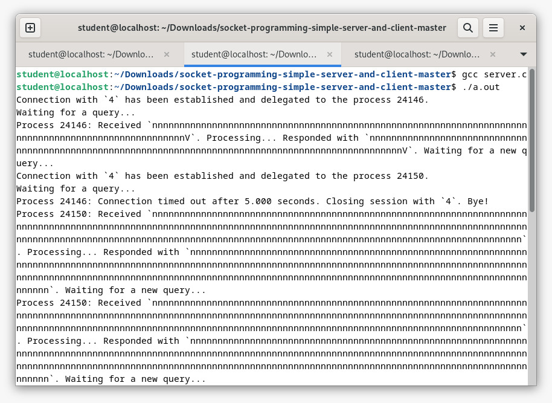
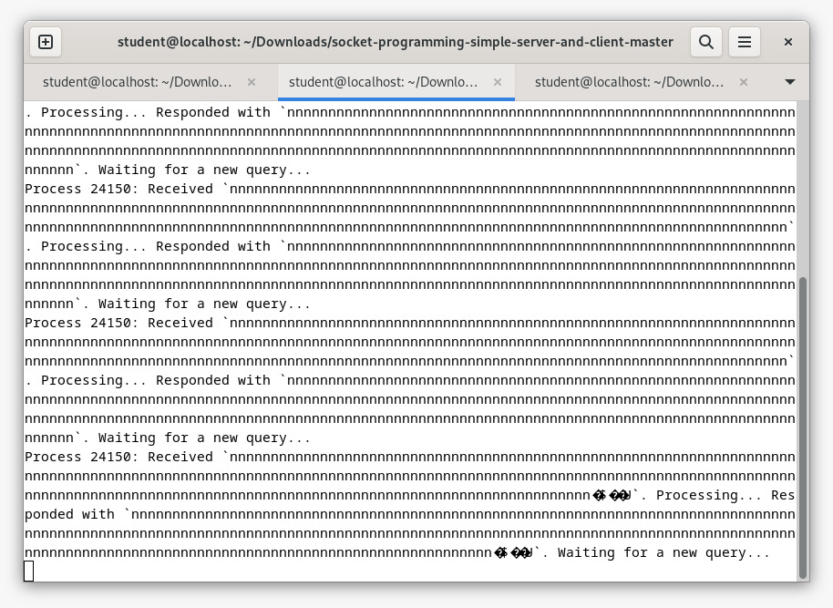
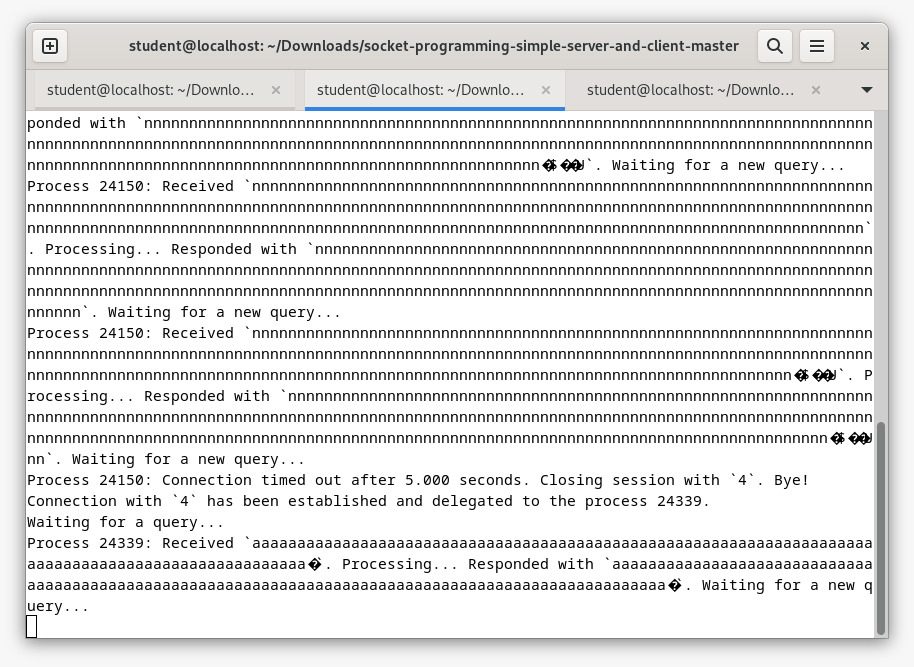
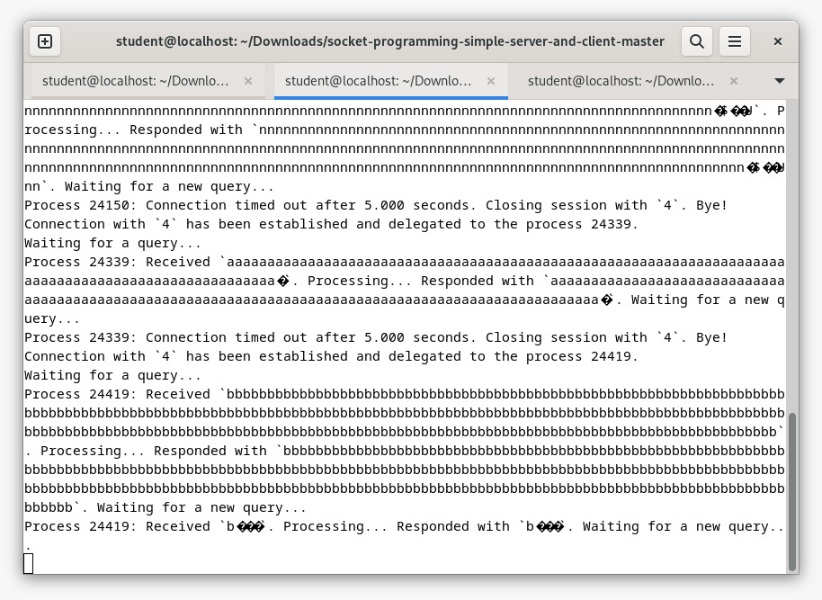
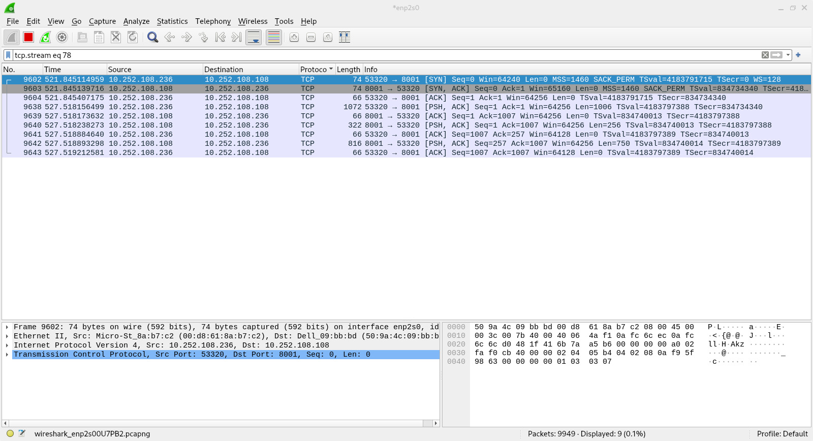
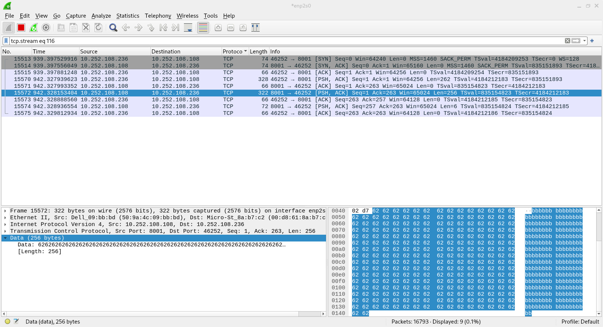

# Analisis Wireshark pada Implementasi Socket Programing Client Server

## Terminal pada Server sebagai receiver
Yang terjadi pada terminal server adalah mengirim/PSH pada client, hal itu bisa terjadi beberapakali dalam suatu proses tergantung banyaknya yang dikirim. 
Dalam hal ini server juga bisa menjadi penerima atau ACT dari client. Banyaknya PSH atau ACT dari server dan cliren pun bisa berbeda-beda meski menjalankan proses yang sama.

Berikut adalah contoh dari beberapa proses yang berbeda yang dijalankan oleh server dan client yang sama :

*Pada Terminal Server*

## Analisis Wireshark pada Proses Pengiriman Client ke Server

Gambar analisis wireshark yang pertama ini menunjukkan server melakukan PSH 1 kali untuk mengirim karakter 'n' sebanyak 1000 kali pada client, tapi client sendiri membutuhkan 2 kali PSH untuk 
mengirimnya kembali pada server. akan tetapi saat mengirim karakter 'n' sebanyak 100 kali baik server maupun client hanya membutuhkan sekali PSH pada prosesnya.

Kemudian di bawah ini adalah gambar untuk proses selanjutnya yang memiliki penjelasan yang sama dengan apa yang terjadi pada proses sebelumnya.

