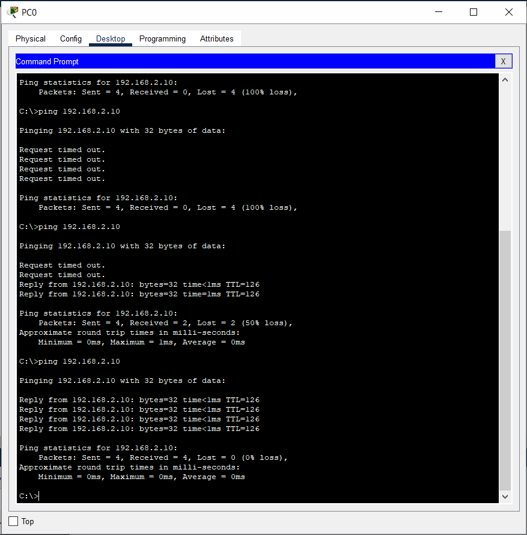

# Cisco Packet Tracer
## Table of Contents

- [Cisco Packet Tracer](#cisco-packet-tracer)
  - [Table of Contents](#table-of-contents)
  - [Desain](#desain)
  - [Langkah-langkah](#langkah-langkah)

## Desain

Ini adalah desain yang akan kita buat.

## Langkah-langkah
1. Letakkan device yang sesuai pada desain .

2. Lalu kita akan menyetting Router0. Hal yang perlu kita setting adalah Interface -> FastEthernet0/0 dan FastEthernet0/Jangan lupa untuk menekan tombol ON pada Port Status.

3. Setelah Router0 di-setting, selanjutnya adalah Router1. Hal yang perlu kita setting adalah Interface -> FastEthernet0/0 dan FastEthernet0/1. Jangan lupa untuk menekan tombol ON pada Port Status.

4. Setelah semua Router dikonfigurasi, kita akan mengonfigurasi tiap-tiap PCnya.

5. Lalu kita akan menyambungkan devicenya menggunakan kabel. Jika konfigurasi sudah benar namun masih warna orange, tunggu saja, nanti akan jadi hijau.

6. Setelah itu kita buka Command Prompt pada PC0 dan coba ping ke PC1 (routernya sama). Terlihat bahwa pingnya sukses.

7. Lalu kita coba ping PC0 ke PC2 (berbeda router). Terlihat bahwa pingnya gagal.

Hal ini dikarenakan apabila device mempunyai subnet yang berbeda dan terkoneksi via router, router-routernya perlu tahu bagaimana cara route traffic antar subnet. Jika router tidak punya informasi mengenai bagaimana cara konek ke specific destination network (di kasus ini, beda subnet), routernya tidak akan bisa forward packets ke subnet tersebut. 
Ada dua cara yang bisa kita lakukan, yaitu mengonfigurasi Routing Protocols (RIP, OSPF, atau BGP) atau Static Routes. Pada percobaan ini, kita akan menggunakan Static Routes.
8. Klik Router0 dan konfigurasi Routing -> Static. Konfigurasinya adalah sebagai berikut:
Network: 192.168.2.0
Mask: 255.255.255.0
Next Hop: 10.0.1.2
Next Hop mereferensi ke network device selanjutnya atau router yang data packetnya akan di-forward. Pada kasus ini kita akan mem-forward dari Router0 ke Router1. FastEthernet0/1 pada Router1 adalah 10.0.1.2, maka Next Hopnya adalah 10.0.1.2.

9. Klik Router1 dan konfigurasi Routing -> Static. Konfigurasinya adalah sebagai berikut:
Network: 192.168.1.0
Mask: 255.255.255.0
Next Hop: 10.0.1.1
Next Hop mereferensi ke network device selanjutnya atau router yang data packetnya akan di-forward. Pada kasus ini kita akan mem-forward dari Router1 ke Router0. FastEthernet0/1 pada Router0 adalah 10.0.1.1, maka NextHopnya adalah 10.0.1.1.

10. Setelah itu pada tiap-tiap PC, kita setting Default Gateway sesuai dengan Routernya.

11. Semua telah terkonfigurasi, saatnya mencoba. Di sini kita akan mencoba ping dari PC0 ke PC1, PC2, dan PC3. Terlihat bahwa semuanya telah berhasil.

12. Percobaan PC1 ke PC0, PC2, dan PC3. Terlihat bahwa semuanya telah berhasil.

13. Percobaan PC2 ke PC0, PC1, dan PC3. Terlihat bahwa semuanya telah berhasil.

14. Percobaan PC3 ke PC0, PC1, dan PC2. Terlihat bahwa semuanya telah berhasil.
