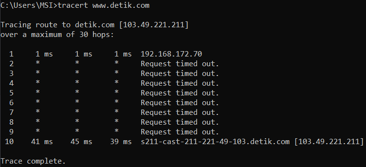

# Ping dan TraceRoute
## Table of Contents

- [Ping dan TraceRoute](#ping-dan-traceroute)
  - [Table of Contents](#table-of-contents)
  - [Penjelasan TraceRoute](#penjelasan-traceroute)
  - [Ping dan TraceRoute](#ping-dan-traceroute-1)

## Penjelasan TraceRoute
tracert (atau traceroute dalam lingkungan sistem operasi Linux) adalah perintah yang digunakan untuk melacak rute yang diambil oleh paket data saat mencoba mencapai tujuan tertentu di jaringan komputer. Saat kita menjalankan tracert di Command Prompt (CMD) di Windows, hasilnya akan menampilkan beberapa kolom yang memberikan informasi tentang rute yang diambil oleh paket data. Berikut adalah penjelasan fungsi dari tiap-tiap kolom pada output tracert:

* Hop Number (Nomor Hop): Ini adalah urutan hop atau lompatan yang dilakukan oleh paket data untuk mencapai tujuan. Setiap baris dalam hasil tracert menunjukkan satu hop atau lompatan.

* Round-Trip Time (RTT): Ini adalah waktu yang diperlukan oleh paket data untuk pergi dari komputer pengirim ke hop tertentu dan kembali lagi ke komputer pengirim. RTT diukur dalam milidetik (ms). RTT memberikan gambaran tentang latensi atau jeda waktu dalam perjalanan paket data.

* IP Address (Alamat IP): Ini adalah alamat IP dari hop tertentu dalam perjalanan paket data. Alamat IP ini dapat membantu mengidentifikasi perangkat atau node jaringan yang digunakan dalam rute.

* Host Name (Nama Host): Ini adalah nama host atau nama perangkat pada hop tertentu dalam perjalanan paket data. Beberapa hop mungkin menampilkan nama host, sementara yang lain hanya menampilkan alamat IP jika nama host tidak dapat diidentifikasi.

## Ping dan TraceRoute
Di sini kita akan mencoba ping dan tracert ke www.detik.com.

Hasil ping yang kita berikan menunjukkan bahwa komputer kita berhasil mengirimkan paket data ke alamat IP 203.190.242.211 (yang merupakan alamat IP dari situs web detik.com) dan menerima balasan (reply) dari alamat tersebut. Berikut adalah penjelasan dari hasil ping tersebut:

* "Pinging detik.com [203.190.242.211] with 32 bytes of data:": Ini adalah pesan yang menunjukkan bahwa komputer kita sedang mengirimkan paket data sebesar 32 byte ke alamat IP 203.190.242.211.

* "Reply from 203.190.242.211: bytes=32 time=42ms TTL=56": Ini adalah balasan dari alamat IP 203.190.242.211. Balasan ini menunjukkan bahwa paket data sebesar 32 byte telah berhasil diterima oleh server di alamat IP tersebut. Waktu yang dibutuhkan untuk perjalanan bolak-balik (round-trip time) adalah 42 milidetik (ms). TTL (Time-To-Live) adalah 56, yang menunjukkan jumlah hop yang tersisa sebelum paket data dihapus dari jaringan.

* "Ping statistics for 203.190.242.211: Packets: Sent = 4, Received = 4, Lost = 0 (0% loss),": Ini adalah statistik ping yang menunjukkan bahwa kita mengirimkan 4 paket data (Sent = 4), semuanya berhasil diterima oleh server (Received = 4), dan tidak ada paket data yang hilang (Lost = 0). Persentase kehilangan paket adalah 0%, yang merupakan hasil yang baik dan menunjukkan koneksi jaringan yang stabil.

* "Approximate round trip times in milli-seconds: Minimum = 42ms, Maximum = 79ms, Average = 54ms": Ini adalah statistik rata-rata waktu perjalanan bolak-balik dari komputer kita ke alamat IP 203.190.242.211. Waktu tercepat (Minimum) adalah 42 ms, waktu terlama (Maximum) adalah 79 ms, dan rata-rata waktu perjalanan adalah 54 ms.

 

Hasil tracert yang kita berikan menunjukkan percobaan melacak rute paket data dari komputer kita ke alamat IP 103.49.221.211, yang merupakan server detik.com. Di sini, setiap baris dalam output mewakili satu hop dalam perjalanan paket data. Mari jelaskan hasilnya:

* "Tracing route to detik.com [103.49.221.211] over a maximum of 30 hops": Pesan ini menunjukkan bahwa komputer kita sedang mencoba melacak rute ke alamat IP 103.49.221.211 melalui maksimal 30 hop (lompatan).

* "1 ms 1 ms 1 ms 192.168.172.70": Ini menunjukkan bahwa komputer kita menghubungi router atau perangkat pertama dalam jaringan lokal kita (alamat IP 192.168.172.70) dengan waktu respons sangat cepat (1 ms).

* "2 - 7: * Request timed out": Hop nomor 2 hingga 7 menunjukkan bahwa paket data kita tidak menerima balasan (timed out) dari perangkat atau router pada hop-hops tersebut. Ini bisa terjadi karena konfigurasi firewall atau router yang tidak mengizinkan merespons permintaan tracert.

* "10 41 ms 45 ms 39 ms s211-cast-211-221-49-103.detik.com [103.49.221.211]": Hop nomor 10 menunjukkan bahwa paket data akhirnya mencapai server detik.com (alokasi alamat IP 103.49.221.211) dengan waktu respons yang bervariasi antara 39 ms hingga 45 ms.

* "Trace complete": Pesan ini menunjukkan bahwa tracert telah menyelesaikan pelacakan rute dan mencapai tujuan, yaitu server detik.com.

