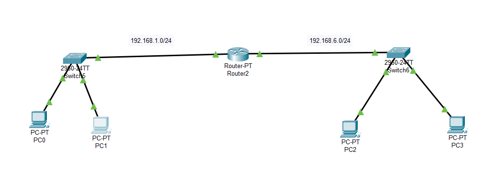
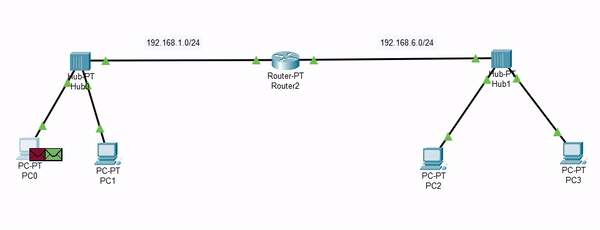
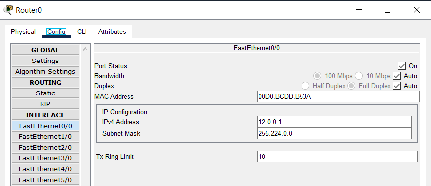
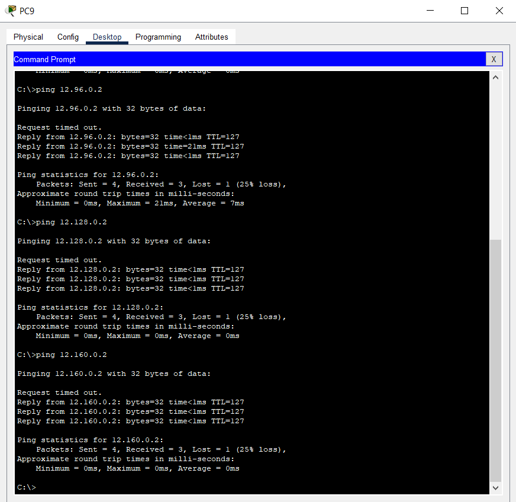

## Table of Contents

- [Table of Contents](#table-of-contents)
- [Switch vs Hub](#switch-vs-hub)
  - [Switch](#switch)
    - [Skenario 1: PC 0 Ping ke PC 1](#skenario-1-pc-0-ping-ke-pc-1)
    - [Skenario 2: PC 1 Ping ke PC 0](#skenario-2-pc-1-ping-ke-pc-0)
    - [Skenario 3: PC 2 Ping ke PC 3](#skenario-3-pc-2-ping-ke-pc-3)
    - [Skenario 4: PC 3 Ping ke PC 2](#skenario-4-pc-3-ping-ke-pc-2)
    - [Skenario 5: PC 0 Ping ke PC 3](#skenario-5-pc-0-ping-ke-pc-3)
    - [Skenario 6: PC 2 Ping ke PC 1](#skenario-6-pc-2-ping-ke-pc-1)
  - [Hub](#hub)
    - [Skenario 1: PC 0 Ping ke PC 1](#skenario-1-pc-0-ping-ke-pc-1-1)
    - [Skenario 2: PC 1 Ping ke PC 0](#skenario-2-pc-1-ping-ke-pc-0-1)
    - [Skenario 3: PC 2 Ping ke PC 3](#skenario-3-pc-2-ping-ke-pc-3-1)
    - [Skenario 4: PC 3 Ping ke PC 2](#skenario-4-pc-3-ping-ke-pc-2-1)
    - [Skenario 5: PC 0 Ping ke PC 3](#skenario-5-pc-0-ping-ke-pc-3-1)
    - [Skenario 6: PC 2 Ping ke PC 1](#skenario-6-pc-2-ping-ke-pc-1-1)
  - [Perbedaan Penggunaan Switch dan Hub](#perbedaan-penggunaan-switch-dan-hub)
    - [Switch](#switch-1)
    - [Hub](#hub-1)
- [Subnetting](#subnetting)

## Switch vs Hub

### Switch

Pada gambar tersebut, kita mempunyai 1 router dan 2 switch di mana masing-masing switch terkoneksi ke 2 PC.

Ini adalah konfigurasi dari Router dan PC:

* Router2 
- FastEthernet 0/0: 192.168.1.1 255.255.255.0
- FastEthernet 1/0: 192.168.6.1 255.255.255.0

* PC 0 
- Default Gateway: 192.168.1.1
- IP and Subnet: 192.168.1.2 255.255.255.0

* PC 1 
- Default Gateway: 192.168.1.1
- IP and Subnet: 192.168.1.3 255.255.255.0

* PC 2 
- Default Gateway: 192.168.6.1
- IP and Subnet: 192.168.6.2 255.255.255.0

* PC 3 
- Default Gateway: 192.168.6.1
- IP and Subnet: 192.168.6.3 255.255.255.0

Setelah semua dikonfigurasi, kita akan mencoba beberapa skenario:
* PC 0 ping ke PC 1
* PC 1 ping ke PC 0
* PC 2 ping ke PC 3
* PC 3 ping ke PC 2
* PC 0 ping ke PC 3
* PC 2 ping ke PC 1

#### Skenario 1: PC 0 Ping ke PC 1

1. **PC 0 (192.168.1.2) melakukan ping ke PC 1 (192.168.1.3)**

    - PC 0 memeriksa bahwa PC 1 berada dalam subnet yang sama.
    - PC 0 mengirimkan permintaan ARP untuk mencari alamat MAC dari PC 1.
    - PC 1 membalas permintaan ARP dengan alamat MAC-nya.
    - PC 0 sekarang mengetahui alamat MAC PC 1 dan mengirimkan paket ICMP echo request (ping).
    - Paket melewati Switch 5 dan mencapai PC 1.
    - PC 1 membalas dengan paket ICMP echo reply, mengkonfirmasi komunikasi yang berhasil.

#### Skenario 2: PC 1 Ping ke PC 0

1. **PC 1 (192.168.1.3) melakukan ping ke PC 0 (192.168.1.2)**

    - PC 1 memeriksa bahwa PC 0 berada dalam subnet yang sama.
    - PC 1 mengirimkan permintaan ARP untuk mencari alamat MAC dari PC 0.
    - PC 0 membalas permintaan ARP dengan alamat MAC-nya.
    - PC 1 sekarang mengetahui alamat MAC PC 0 dan mengirimkan paket ICMP echo request.
    - Paket melewati Switch 5 dan mencapai PC 0.
    - PC 0 membalas dengan paket ICMP echo reply, mengkonfirmasi komunikasi yang berhasil.

#### Skenario 3: PC 2 Ping ke PC 3

1. **PC 2 (192.168.6.2) melakukan ping ke PC 3 (192.168.6.3)**

    - PC 2 memeriksa bahwa PC 3 berada dalam subnet yang sama.
    - PC 2 mengirimkan permintaan ARP untuk mencari alamat MAC dari PC 3.
    - PC 3 membalas permintaan ARP dengan alamat MAC-nya.
    - PC 2 sekarang mengetahui alamat MAC PC 3 dan mengirimkan paket ICMP echo request.
    - Paket melewati Switch 6 dan mencapai PC 3.
    - PC 3 membalas dengan paket ICMP echo reply, mengkonfirmasi komunikasi yang berhasil.

#### Skenario 4: PC 3 Ping ke PC 2

1. **PC 3 (192.168.6.3) melakukan ping ke PC 2 (192.168.6.2)**

    - PC 3 memeriksa bahwa PC 2 berada dalam subnet yang sama.
    - PC 3 mengirimkan permintaan ARP untuk mencari alamat MAC dari PC 2.
    - PC 2 membalas permintaan ARP dengan alamat MAC-nya.
    - PC 3 sekarang mengetahui alamat MAC PC 2 dan mengirimkan paket ICMP echo request.
    - Paket melewati Switch 6 dan mencapai PC 2.
    - PC 2 membalas dengan paket ICMP echo reply, mengkonfirmasi komunikasi yang berhasil.

#### Skenario 5: PC 0 Ping ke PC 3

1. **PC 0 (192.168.1.2) melakukan ping ke PC 3 (192.168.6.3)**

    - PC 0 memeriksa bahwa PC 3 berada dalam subnet yang berbeda.
    - PC 0 mengirimkan permintaan ARP untuk mencari alamat MAC dari antarmuka Router 2 yang terhubung ke Switch 5.
    - Router 2 membalas permintaan ARP dengan alamat MAC-nya.
    - PC 0 sekarang mengetahui alamat MAC Router 2 dan mengirimkan paket ICMP echo request.
    - Paket melewati Switch 5, Router 2, dan Switch 6, mencapai PC 3.
    - PC 3 membalas dengan paket ICMP echo reply, mengkonfirmasi komunikasi yang berhasil.

#### Skenario 6: PC 2 Ping ke PC 1

1. **PC 2 (192.168.6.2) melakukan ping ke PC 1 (192.168.1.3)**

    - PC 2 memeriksa bahwa PC 1 berada dalam subnet yang berbeda.
    - PC 2 mengirimkan permintaan ARP untuk mencari alamat MAC dari antarmuka Router 2 yang terhubung ke Switch 6.
    - Router 2 membalas permintaan ARP dengan alamat MAC-nya.
    - PC 2 sekarang mengetahui alamat MAC Router 2 dan mengirimkan paket ICMP echo request.
    - Paket melewati Switch 6, Router 2, dan Switch 5, mencapai PC 1.
    - PC 1 membalas dengan paket ICMP echo reply, mengkonfirmasi komunikasi yang berhasil.

Dalam skenario-skenario ini, ARP digunakan untuk mencari alamat MAC dari alamat IP, dan komunikasi antara PC melibatkan ARP untuk komunikasi lokal dalam subnet yang sama dan routing melalui Router 2 untuk komunikasi antara subnet yang berbeda.

### Hub

Dengan konfigurasi yang sama, kita akan mencoba skenario sebelumnya menggunakan Hub.

#### Skenario 1: PC 0 Ping ke PC 1

1. **PC 0 (192.168.1.2) melakukan ping ke PC 1 (192.168.1.3)**

   - PC 0 memeriksa bahwa PC 1 berada dalam subnet yang sama.
   - PC 0 mengirimkan permintaan ARP dalam bentuk broadcast untuk mencari alamat MAC dari PC 1.
   - Permintaan ARP dan paket data berikutnya dikirimkan ke semua perangkat yang terhubung ke hub.
   - Baik PC 0 maupun PC 1 menerima permintaan ARP, tetapi hanya PC 1 yang membalas dengan alamat MAC-nya.
   - PC 0 sekarang mengetahui alamat MAC PC 1 dan mengirimkan paket ICMP echo request.
   - Paket tersebut melewati Hub 0 dan mencapai PC 1.
   - PC 1 membalas dengan paket ICMP echo reply, mengkonfirmasi komunikasi yang berhasil.

#### Skenario 2: PC 1 Ping ke PC 0

1. **PC 1 (192.168.1.3) melakukan ping ke PC 0 (192.168.1.2)**

   - PC 1 memeriksa bahwa PC 0 berada dalam subnet yang sama.
   - PC 1 mengirimkan permintaan ARP dalam bentuk broadcast untuk mencari alamat MAC dari PC 0.
   - Permintaan ARP dan paket data berikutnya dikirimkan ke semua perangkat yang terhubung ke hub.
   - Baik PC 1 maupun PC 0 menerima permintaan ARP, tetapi hanya PC 0 yang membalas dengan alamat MAC-nya.
   - PC 1 sekarang mengetahui alamat MAC PC 0 dan mengirimkan paket ICMP echo request.
   - Paket tersebut melewati Hub 0 dan mencapai PC 0.
   - PC 0 membalas dengan paket ICMP echo reply, mengkonfirmasi komunikasi yang berhasil.

#### Skenario 3: PC 2 Ping ke PC 3

1. **PC 2 (192.168.6.2) melakukan ping ke PC 3 (192.168.6.3)**

   - PC 2 memeriksa bahwa PC 3 berada dalam subnet yang sama.
   - PC 2 mengirimkan permintaan ARP dalam bentuk broadcast untuk mencari alamat MAC dari PC 3.
   - Permintaan ARP dan paket data berikutnya dikirimkan ke semua perangkat yang terhubung ke hub.
   - Baik PC 2 maupun PC 3 menerima permintaan ARP, tetapi hanya PC 3 yang membalas dengan alamat MAC-nya.
   - PC 2 sekarang mengetahui alamat MAC PC 3 dan mengirimkan paket ICMP echo request.
   - Paket tersebut melewati Hub 1 dan mencapai PC 3.
   - PC 3 membalas dengan paket ICMP echo reply, mengkonfirmasi komunikasi yang berhasil.

#### Skenario 4: PC 3 Ping ke PC 2

1. **PC 3 (192.168.6.3) melakukan ping ke PC 2 (192.168.6.2)**

   - PC 3 memeriksa bahwa PC 2 berada dalam subnet yang sama.
   - PC 3 mengirimkan permintaan ARP dalam bentuk broadcast untuk mencari alamat MAC dari PC 2.
   - Permintaan ARP dan paket data berikutnya dikirimkan ke semua perangkat yang terhubung ke hub.
   - Baik PC 3 maupun PC 2 menerima permintaan ARP, tetapi hanya PC 2 yang membalas dengan alamat MAC-nya.
   - PC 3 sekarang mengetahui alamat MAC PC 2 dan mengirimkan paket ICMP echo request.
   - Paket tersebut melewati Hub 1 dan mencapai PC 2.
   - PC 2 membalas dengan paket ICMP echo reply, mengkonfirmasi komunikasi yang berhasil.

#### Skenario 5: PC 0 Ping ke PC 3

1. **PC 0 (192.168.1.2) melakukan ping ke PC 3 (192.168.6.3)**

   - PC 0 memeriksa bahwa PC 3 berada dalam subnet yang berbeda.
   - PC 0 mengirimkan permintaan ARP dalam bentuk broadcast untuk mencari alamat MAC dari antarmuka Router2 yang terhubung ke Hub 0.
   - Permintaan ARP dan paket data berikutnya dikirimkan ke semua perangkat yang terhubung ke Hub 0.
   - Baik PC 0 maupun Router2 menerima permintaan ARP, tetapi hanya Router2 yang membalas dengan alamat MAC-nya.
   - PC 0 sekarang mengetahui alamat MAC Router2 dan mengirimkan paket ICMP echo request.
   - Paket tersebut melewati Hub 0, Router2, dan Hub 1, mencapai PC 3.
   - PC 3 membalas dengan paket ICMP echo reply, mengkonfirmasi komunikasi yang berhasil.

#### Skenario 6: PC 2 Ping ke PC 1

1. **PC 2 (192.168.6.2) melakukan ping ke PC 1 (192.168.1.3)**

   - PC 2 memeriksa bahwa PC 1 berada dalam subnet yang berbeda.
   - PC 2 mengirimkan permintaan ARP dalam bentuk broadcast untuk mencari alamat MAC dari antarmuka Router2 yang terhubung ke Hub 1.
   - Permintaan ARP dan paket data berikutnya dikirimkan ke semua perangkat yang terhubung ke Hub 1.
   - Baik PC 2 maupun Router2 menerima permintaan ARP, tetapi hanya Router2 yang membalas dengan alamat MAC-nya.
   - PC 2 sekarang mengetahui alamat MAC Router2 dan mengirimkan paket ICMP echo request.
   - Paket tersebut melewati Hub 1, Router2, dan Hub 0, mencapai PC 1.
   - PC 1 membalas dengan paket ICMP echo reply, mengkonfirmasi komunikasi yang berhasil.

Dalam skenario ini, karena menggunakan hub, semua data dan permintaan ARP di-broadcast ke semua perangkat yang terhubung ke dalamnya. Hal ini dapat menghasilkan traffic yang tidak efisien dan membebani jaringan, terutama ketika ada banyak perangkat yang aktif di jaringan tersebut.

### Perbedaan Penggunaan Switch dan Hub

#### Switch

1. **Data Transfer yang Efisien:**
   - **Switch:** Switch mengirimkan data hanya ke perangkat yang dituju berdasarkan alamat MAC. Hanya perangkat yang membutuhkan data yang akan menerima paket tersebut.
   - **Dampak Skenario:** Dalam skenario penggunaan switch, data hanya akan dikirimkan ke perangkat yang dituju. Contohnya, ketika PC 0 melakukan ping ke PC 1, data hanya akan mencapai PC 1, tidak ada perangkat lain yang menerima paket tersebut.

2. **Collision Management yang Cerdas:**
   - **Switch:** Switch mengelola collision dengan cerdas, mengalokasikan jalur khusus untuk setiap perangkat yang berkomunikasi. Ini mengurangi kemungkinan collision dan memastikan pengiriman data yang lebih lancar.
   - **Dampak Skenario:** Dalam skenario dengan switch, collision sangat minim atau bahkan tidak ada, memastikan efisiensi dan kinerja jaringan yang optimal.

3. **ARP Broadcast yang Terfokus:**
   - **Switch:** Switch hanya meneruskan pesan ARP ke perangkat yang membutuhkannya. Setelah alamat MAC diketahui, switch hanya mengirimkan data ke perangkat yang tepat.
   - **Dampak Skenario:** Pesan ARP hanya akan mencapai perangkat yang relevan, mengurangi traffic ARP yang tidak perlu di jaringan.

#### Hub

1. **Data Transfer yang Tidak Efisien:**
   - **Hub:** Hub mengirimkan data ke semua perangkat yang terhubung, tidak memperhatikan perangkat mana yang sebenarnya membutuhkannya.
   - **Dampak Skenario:** Dalam skenario penggunaan hub, setiap paket data atau pesan ARP akan diterima oleh semua perangkat yang terhubung ke dalamnya. Ini menciptakan traffic yang tidak efisien dan dapat mengakibatkan overhead yang tinggi pada jaringan.

2. **Collision Management yang Kurang Efisien:**
   - **Hub:** Hub tidak mengelola collision dengan cerdas. Jika dua perangkat mencoba mengirimkan data secara bersamaan, hal ini dapat mengakibatkan collision dan memerlukan pengiriman ulang, mengurangi efisiensi.
   - **Dampak Skenario:** Dalam skenario dengan hub, terdapat risiko collision yang lebih tinggi, yang mengarah pada kinerja jaringan yang kurang optimal.

3. **ARP Broadcast yang Merata:**
   - **Hub:** Pesan ARP dan data disiarkan ke semua perangkat tanpa pengecualian, bahkan jika hanya satu perangkat yang membutuhkannya.
   - **Dampak Skenario:** Semua perangkat dalam jaringan akan menerima pesan ARP, yang menciptakan traffic ARP yang lebih besar dan membebani jaringan.

Dalam rangkaian skenario yang diberikan, penggunaan switch menghasilkan komunikasi yang lebih efisien, kinerja jaringan yang optimal, dan manajemen traffic yang cerdas. Sebaliknya, penggunaan hub menghasilkan traffic yang tidak efisien, risiko collision yang tinggi, dan overhead yang lebih besar pada jaringan. Oleh karena itu, switch secara umum merupakan pilihan yang lebih baik untuk jaringan modern karena meningkatkan efisiensi dan kinerja.

## Subnetting
Di sini kita akan subnet IP public menjadi 6 subnet menggunakan Cisco Packet Tracer.

IP Public: 12.0.0.0/8

Untuk mengubah IP tersebut menjadi 6 subnet, kita harus mengubah netmasknya. Netmask menentukan seberapa banyak bit yang digunakan untuk mengidentifikasi jaringan dalam alamat IP.

Pada IP tersebut, 8 bit pertama adalah bagian dari Network Address dan 24 bit terakhir adalah bagian yang dapat digunakan untuk Host. Jika kita tulis dalam format biner, ini adalah netmasknya: 11111111.00000000.00000000.00000000. 8 bit pertama adalah 1 (dalam notasi biner), 24 sisanya adalah 0. Jadi netmask dalam desimal adalah 255.0.0.0.

Kita kan akan membuat 6 subnet, jadi kita perlu menambahkan 3 bit ke netmask karena 2^3 = 8 (kita mencari nilai yang paling dekat dengan jumlah subnetnya).

* Netmask awal: 255.0.0.0 atau 11111111.00000000.00000000.00000000
* Netmask sesudah: 255.224.0.0 atau 11111111.11100000.00000000.00000000 (bertambah 3 bit).

Hasilnya adalah: 12.0.0.0/11 dengan netmask 255.224.0.0.

Lalu kita dapat membuat 6 subnet yang berbeda sebagai berikut:
* Subnet 1: 12.0.0.0/11
* Subnet 2: 12.32.0.0/11
* Subnet 3: 12.64.0.0/11
* Subnet 4: 12.96.0.0/11
* Subnet 5: 12.128.0.0/11
* Subnet 6: 12.160.0.0/11

Nah karena sudah dapat hasil perhitungannya, kita bisa langsung membuatnya di Packet Tracer. Kita membutuhkan 1 router dan 6 switch di mana masing-masing switch terdapat 1 PC. Lalu kita akan menghubungkannya menggunakan kabel Copper Straight-Through.

Sebelum mengonfigurasi IP di router, kita harus menambahkan dulu slot agar FastEthernetnya ada 6. Kita bisa drag PT-ROUTER-NM-1CFE ke dalam slotnya.

Setelah itu, baru kita mengonfigurasi IP di dalam routernya sebagai berikut:

Lalu kita kan mengonfigurasi IP di masing-masing PC:

Jangan lupa untuk set Default Gatewaynya.

Lalu kita akan mencoba ping dari 1 PC ke PC lainnya.
* PC 1

* PC 2

* PC 3

* PC 4

* PC 5

* PC 6

Dengan begitu, kita sudah berhasil membuat 6 subnet dari IP Public 12.0.0.0/8.
